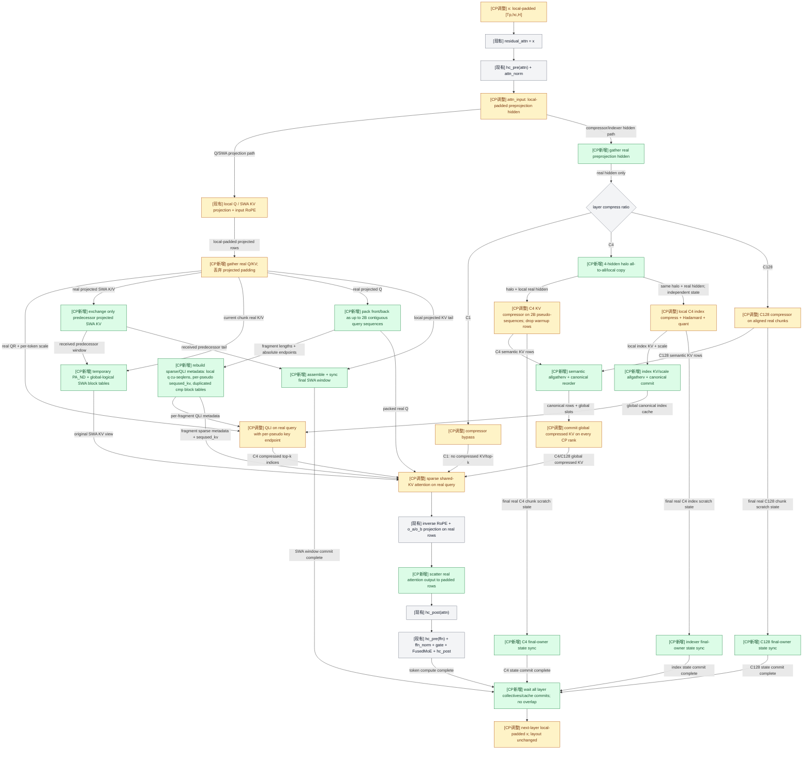
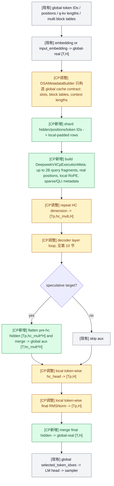
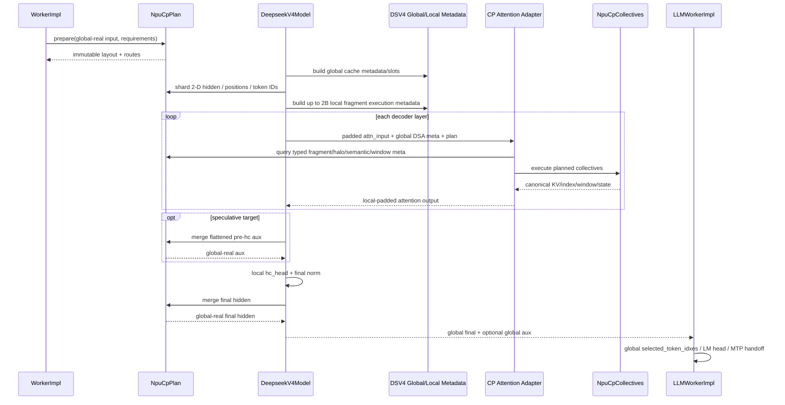

# DeepSeek V4 NPU Context Parallel Post-Compressor 设计与实施计划

## 1. 文档状态

- 状态：已按当前代码完成主模型、DSA layer、输出和 MTP 数据流复核；设计待review，待实现。
- 目标平台：仅 NPU Torch 路径。
- 目标模型：`deepseek_v4`，以及 `deepseek_v4_mtp` 的 prefill 类阶段。
- 核心目标：在保持 DeepSeek V4 KV 压缩语义正确的前提下，为 prefill 引入 Context Parallel，并将通信量限制在必要的 halo、compressed KV、index、SWA 窗口和 continuation state。
- 非目标：本期不新增 compressor 算子，不实现计算通信 overlap，不扩展 Mooncake 的 DeepSeek V4 state 传输，不在 decode 阶段启用 CP。

## 2. 背景与现状

### 2.1 当前 NPU CP 流程

当前 NPU ATB CP 的基本流程为：

1. embedding 后按 zigzag 布局切分输入。
2. 每个 CP rank 处理两个物理 chunk。
3. decoder layer 在本地 hidden 上计算。
4. 最终输出按原 token 顺序 gather 和 unpad。

当前 zigzag 将一个 sequence 切为 `2 * cp_size` 个连续 chunk。rank `r` 持有：

```text
front_chunk_id = r
back_chunk_id  = 2 * cp_size - 1 - r
```

现有方案只要求 sequence 长度可被 `2 * cp_size` 整除，无法直接满足 DeepSeek V4 C128 和 C4 compressor 的边界要求。

### 2.2 DeepSeek V4 attention 流程

DeepSeek V4 DSA attention 的主要数据流为：

```text
attention input
  -> HC / attention norm
  -> query 和原始 SWA KV 投影
  -> C1 SWA 或 C4/C128 compressor
  -> C4 index compressor + Hadamard + dynamic quant
  -> index cache / compressed KV cache
  -> QLI top-k
  -> sparse shared-KV attention
  -> attention output
```

C128 按绝对位置的 128-token group 压缩。C4 包含跨 group 的滑动重叠语义，当前 group 的计算需要前一个 group 的尾部信息。因此，不能先对未压缩 KV 或完整 hidden 做全量 CP allgather；必须先在本地生成 semantic compressed rows，再通信和重排。

### 2.3 关键前提

- compressor 被保守地视为不会自动忽略 padding token。
- padding token 不能进入 compressor，不能生成 compressed KV，也不能推进 compressor state。
- CP group 内所有 rank 最终拥有相同的全局 compressed KV、index cache 和可继续执行所需的 state。
- 原始 SWA KV 不做全量复制，只同步当前计算需要的前驱窗口及后续 continuation 所需的最终窗口。
- `kv_split_size` 必须为 1；CP rank 各自持有完整的 CP 逻辑 cache，DP replica 之间仍相互独立。

## 3. 设计原则与不变量

### 3.1 布局不变量

1. 每个 sequence 独立规划 zigzag chunk 和 padding。
2. 每个物理 chunk 的长度必须对齐到 `lcm(4, 128) = 128`。
3. layer 之间保持固定的 padded hidden 布局。
4. compressor 和 attention 只消费 real-token view。
5. attention 输出 scatter 回原 padded hidden 位置，以保证下一层复用同一布局。
6. padding 只服务于 layout、shape 稳定性和 CP 重组，不进入 semantic cache。

### 3.2 Cache 不变量

1. compressed KV、index、index scale 按全局 sequence 顺序提交到每个 CP rank 的本地 cache。
2. 每个 semantic compressed row 只对应真实 token 范围。
3. compressor 的 persistent continuation state 由每个 sequence 的最后真实 chunk 唯一产生。
4. padding chunk 或空 chunk 不成为 state owner。
5. CP 完成后，各 rank 对下一次 chunked prefill 或 decode 看到相同的逻辑 continuation 状态。

### 3.3 通信不变量

1. 不在 layer attention 内 allgather 全量 hidden；仅模型输出边界 merge final hidden 和必要的 MTP aux。
2. 不 allgather 全量原始 SWA KV。
3. 不发送 padding 产生的 compressed rows。
4. C4 只传输 compressor 所需的 4-token preprojection hidden halo。
5. compressed KV 和 index 使用 variable-count collective，仅发送 real semantic rows。
6. 第一版所有 collective 均阻塞完成，不允许跨 layer 生命周期。

## 4. 并行拓扑

### 4.1 NPU group 布局

NPU Torch 使用正交的 `[DP][CP][attention-TP]` 布局：

```text
attention_tp_size = world_size / (dp_size * cp_size)

global_rank = dp_rank * (cp_size * attention_tp_size)
            + cp_rank * attention_tp_size
            + attention_tp_rank
```

group 定义如下：

- TP group：固定 `dp_rank` 和 `cp_rank`，遍历 `attention_tp_rank`。
- CP group：固定 `dp_rank` 和 `attention_tp_rank`，遍历 `cp_rank`。
- DP group：固定 `cp_rank` 和 `attention_tp_rank`，遍历 `dp_rank`。

例如 `world=8, dp=1, cp=2, attention_tp=4`：

```text
TP groups: [0,1,2,3], [4,5,6,7]
CP groups: [0,4], [1,5], [2,6], [3,7]
```

`cp_group = tp_group` 是 MLU 特有实现，必须移动到 MLU 平台分支，不能继续影响 NPU Torch。

当前 `DeepseekV4ModelImpl` 和 `DeepseekV4MtpModelImpl` 使用 `world_size / dp_size` 计算 `dp_local_tp_size`。CP 开启后该值错误地包含 CP 维，必须改为 true `attention_tp_size`，并确保 `DSAttentionImpl` 中所有 column/row parallel linear、head shard、attention sink 和 QLI local heads 都绑定上述 TP group，而不是 CP group 或包含 CP 的 DP-local world。

### 4.2 EP 与 DP

EP 保持当前与其他并行维度重叠的语义，本期不引入独立的 DP × CP × TP × EP 四维笛卡尔拓扑。

attention 在每个 DP replica 内沿 CP group 执行。为了让 FusedMoE 正确处理 CP padding，新增：

```text
dp_cp_padded_token_nums[dp_rank]
```

该向量表示每个 DP replica 在当前 CP shard 上的 padded token 数：

1. 每个 forward 在固定 `cp_rank/tp_rank` 的 DP group 内收集一次。
2. CP 开启时，FusedMoE 使用该向量完成 DP gather 和结果切片。
3. 不覆盖现有 `dp_global_token_nums`，后者继续表达 pre-CP real token 语义。
4. 必须支持某个 DP replica 没有 sequence 的空 batch 情况。

## 5. Zigzag 与 Padding 设计

### 5.1 Per-sequence chunk 大小

对每个 sequence `s` 独立计算：

```text
P   = cp_size
L_s = 当前 prefill segment 的真实 token 数
C_s = align_up(ceil(L_s / (2 * P)), 128)
```

sequence 的物理布局为 `2P` 个等长 chunk，每个 chunk 长度为 `C_s`。末尾不足部分补 padding。不同 sequence 可以使用不同的 `C_s`。

rank `r` 持有 `front=r` 和 `back=2P-1-r` 两个 chunk。每个 chunk 的 plan 必须记录：

- sequence id。
- global chunk id 和 owner rank。
- padded global token 区间。
- real token 区间及 real length。
- rank-local padded offset。
- rank-local real-token gather index。
- 前驱 chunk 及其 owner。
- 是否为该 sequence 的最后真实 chunk。
- C4/C128 semantic row 范围，以及 C1/SWA real-token 范围。

### 5.2 Padded hidden 与 real-token view

`padded hidden` 是层间持久布局，包含真实 token 和为了 128 对齐补出的 token。它的作用是：

- 固定每层输入输出 shape。
- 简化 zigzag rank-local offset 计算。
- 让 HC、Norm、Q/KV projection 和 FFN/MoE 复用稳定布局。
- 避免每层重新构造不同 shape 的 hidden。

`real-token view` 是通过 `NpuCpPlan` 预计算 index 从 padded hidden 选出的真实 token。它只在 semantic 算子边界使用：

- compressor 前选出 real preprojection hidden。
- projected query 和原始 SWA KV 选出 real rows。
- attention 只为 real query 计算。
- attention 输出按逆映射 scatter 回 padded hidden。

因此，不执行 whole-layer unpad，也不允许 compressor 看到 padding。

### 5.3 Prefix 和 chunked prefill 对齐

为了避免跨 CP chunk 传输 C128 partial state，要求：

- `prefix_len % 128 == 0`。
- 每个非最终 chunked-prefill segment 的长度 `% 128 == 0`。
- 每个物理 zigzag chunk 长度 `% 128 == 0`。
- 最终 segment 可以不对齐，通过尾部 padding 补齐物理布局。
- prefix hit 不对齐时，回退到前一个 128 边界，最多重算 127 token。

## 6. C4 Hidden Halo

### 6.1 传输内容

本期不增加新的 compressor 算子，因此 C4 halo 传输投影前 hidden。具体为 decoder 中 `hc_pre + attention norm` 之后、进入 compressor 之前的 `attn_input`。

每个非首 chunk 需要前驱 chunk 的最后 4 个真实 token。消息包含：

- sequence id 或由 plan 隐式确定的 sequence 顺序。
- 最多 4 个 hidden row。
- valid tail count。
- 目标 side，即 front 或 back。

固定 packing shape 可以使用 `[num_sequences, 4, hidden_size]`，但接收后必须依据 valid count 只把真实 halo 放入 compressor 输入。

### 6.2 Zigzag 方向

rank `r` 的通信关系为：

```text
front chunk r:
  receive predecessor tail from rank r - 1
  send own tail to rank r + 1

back chunk 2P - 1 - r:
  receive predecessor tail from rank r + 1
  send own tail to rank r - 1
```

边界处理：

- rank 0 的 front chunk 是 segment 首 chunk，从 persistent prefix state/SWA window 开始，不接收 halo。
- rank `P-1` 的 front/back 中间边界位于同一 rank，使用本地复制。
- `P=1` 时全部边界本地处理，不发起 halo collective。
- successor chunk 没有真实 token 时，忽略收到的 halo。

所有 sequence 和两个方向打包到一次稀疏 `all_to_all_single` 中。send/recv split 由 plan 预计算，并要求任意 peer pair 的 send/recv count 严格一致。

### 6.3 Front/back pseudo-sequence

每个原始 sequence 在本 rank 上拆为两个连续 pseudo-sequence：

```text
[sequence/front, sequence/back]
```

因此 compressor 和 sparse attention 的 local `cu_seqlens` 都描述最多 `2 * batch_size` 个独立 segment。空 front/back segment 保留在 host plan 中，但不进入 real-token TND tensor。

对于需要前驱的 chunk：

```text
compressor_input = [valid_halo, real_chunk_hidden]
start_pos        = chunk_start_pos - valid_halo_count
```

halo 会产生一个仅用于恢复滑动窗口语义的 warmup compressed row。该 row 必须在 local semantic packing 时丢弃，只保留属于当前 chunk 的 compressed rows。

attention 侧也必须拆分，不能把同一 rank 的 front/back 直接拼成一个 query sequence。`sparse_attn_sharedkv` 的右下角 causal 对齐使用：

```text
query_absolute_position = seqused_kv - query_len + query_local_index
```

因此每个 non-empty pseudo-sequence 必须单独提供：

- 连续的 real query rows。
- `query_len = chunk_real_len`。
- `seqused_kv = prefix_len + chunk_end_in_current_segment`。
- 指向同一原始 sequence cache 的 duplicated compressed block-table row。
- 按全局逻辑页号构造的临时 SWA block-table row。

这样 front 和 back 的 causal、SWA window、compressed cache 可见范围都与其绝对位置一致。仅给 compressor 构造 `2B` metadata、而 attention 继续使用原始 `B` metadata 是错误的。

## 7. 本地压缩与全局重排

### 7.1 Local compressor

每个 rank 只对本地 real-token view 调用现有 compressor：

- C1：不调用 compressor，不生成 compressed rows，只使用 real-token SWA 路径。
- C4：使用 hidden halo 恢复前驱窗口，并删除 warmup row。
- C128：由于 chunk 起点和 prefix 起点均为 128 对齐，可在每个 chunk 独立开始，不交换 partial C128 state。

padding 不进入 compressor，因此：

- 不依赖 compressor 的 `seqused` 行为。
- 不产生 padding compressed KV。
- 不修改 persistent state。
- 不需要在 attention 前再次识别并删除 padding compressed KV。

### 7.2 Semantic allgatherv

ProcessGroup 没有独立的 allgatherv 接口，因此使用 `all_to_all_single` 模拟：

1. 每个 rank 将自己的 local semantic pack 复制为面向所有 CP peers 的 send segments。
2. 每个 destination 的 send count 等于本 rank 的真实 semantic row 数。
3. output split sizes 由所有 source rank 的 plan 确定。
4. collective 完成后，根据预计算 source mapping 直接写入 canonical output。

local semantic pack 顺序为：

```text
[sequence][local front/back][semantic row]
```

canonical output 顺序为：

```text
[sequence][global chunk 0 ... 2P-1][valid semantic row]
```

同一套参数化 planner 和 collective 用于：

- C4/C128 compressed KV；C1 不进入该 collective。
- C4 index KV。
- C4 index scale。

reorder 与 unpad 融合完成，不构造 post-compressor dummy rows。

### 7.3 C4 indexer 拆分

现有 C4 indexer 流程需要拆为两个可复用阶段：

```text
prepare_local_index
  -> local compressor
  -> Hadamard
  -> dynamic quant
  -> local index KV / scale / scratch state

select_from_global_index
  -> build query / weight
  -> read global index KV / scale cache
  -> QLI top-k
```

非 CP 路径继续由现有 `select_qli` 组合两个阶段。CP 路径在两个阶段之间插入 semantic allgatherv、canonical reorder 和 cache commit。

## 8. 原始 SWA KV

原始 SWA KV 的通信与 compressed KV 分离，禁止对整段原始 KV 做 allgather。

新增参数化 `CpSlidingWindowPlan(window_size)`：

1. 对每个 local chunk 计算 attention 所需的前驱 token 区间。
2. 只交换前驱 projected K/V，不交换更早的 token。
3. 默认 `window_size=128` 且 `C_s>=128`，因此最多需要直接前驱 chunk 的 127 个 token。
4. rank `P-1` 的中间边界使用本地数据。
5. chunk 0 从 persistent prefix SWA cache 读取历史窗口。
6. planner 支持未来 `window_size > C_s` 时跨多个前驱 chunk，但首版默认路径只需一个前驱。

每个 pseudo-sequence 的临时 PA_ND view 只装载实际需要的 predecessor window 和当前 chunk projected KV，但 block table 保留全局逻辑 token 页号。kernel 的 `DataCopyPA` 使用 `curS2Offset / block_size` 直接索引 block-table column，确认这里是绝对逻辑页寻址。因此临时 table 的列数必须覆盖到 `ceil(logical_kv_end / block_size)`：窗口内页映射到真实临时 block，早于窗口且 band mask 不会读取的页映射到一个有效 dummy block，不能填 `-1`。传给算子的 `seqused_kv` 必须保持 `prefix_len + chunk_end`，不能替换成本地临时 PA_ND 中的 row 数；否则右下角 causal 对齐会把该 chunk 错当成整个 sequence 的最后一段 query。

每层完成后，每个 sequence 的 final owner 将最终全局 SWA window 同步到所有 CP ranks，作为下一段 chunked prefill 或 decode 的 continuation window。历史 SWA 物理 cache 不要求在 CP ranks 间逐行完全一致；要求一致的是后续计算可观察的逻辑窗口。

## 9. Compressor State 与最终 Owner

### 9.1 Scratch 与 persistent state 分离

NPU compressor 会原地修改传入 state，因此 parallel chunk 不能直接写 persistent cache。每个 chunk 必须使用独立 scratch state：

- 当前 segment 的第一个 C4 chunk 可从已有 persistent state 初始化。
- 后续 C4 chunk通过 hidden halo 重建 overlap 上下文。
- C128 chunk 在 128 对齐边界独立开始。
- indexer compressor 使用独立的 index scratch state。
- scratch storage 不得与 persistent cache alias。

### 9.2 Final owner

对每个 sequence，包含最后一个真实 token 的 chunk 是 final owner。owner rank 由 `NpuCpPlan` 动态计算，不能固定为 rank 0。

所有 chunk 都贡献 compressed KV，但只有 final owner 贡献 continuation state。state packet 包含：

- sequence id。
- state kind。
- valid tail count。
- persistent cache target slots。
- state payload。

需要同步的物理 tail 为：

| State | KV tail | Score tail |
|---|---:|---:|
| C128 attention | `[128, D]` | `[128, D]` |
| C4 attention | `[4, 2D]` | `[4, 2D]` |
| C4 indexer | `[4, 2D_index]` | `[4, 2D_index]` |

final-state sync 完成后，每个 CP rank 将相同 state 写入自己的 persistent cache。无真实 token 的 sequence/chunk 不产生提交。

## 10. Layer 内完整数据流

图例：绿色 `[CP新增]` 表示新模块或新通信；黄色 `[CP调整]` 表示复用现有算子但改变输入、metadata 或调用位置；灰色 `[现有]` 表示不改变语义的现有路径。

箭头标签表示该边传递的 payload 或满足的依赖。`H` 的 C1/C4/C128 是互斥分支；`M`、`Q`、`S`、`V` 是算子输入依赖汇聚，不表示把 tensor 沿最后一维拼接；`AF` 是 layer 返回前的完成屏障，不是数据 tensor 汇聚。



## 11. Cache、Chunked Prefill、Prefix 与 PD

### 11.1 Chunked prefill

Chunked prefill 是首版必须支持的能力。每个 CP layer 返回前必须完成：

- 当前 segment 的全局 compressed KV commit。
- C4 index KV 和 scale commit。
- final compressor/indexer state commit。
- final SWA continuation window commit。

因此下一段 chunked prefill 观察到的 cache/state 与非 CP 执行等价。

“allgather + reorder 后与非 CP 一样”的前提对 compressed KV/index 成立：每个 CP rank 都提交同一份 canonical cache。对原始 SWA 不需要复制完整历史，但必须同步等价的最终逻辑 window；对 compressor/indexer 还必须同步 final continuation state。满足这三项后，下一段 chunked prefill 和后续非 CP decode 才能天然复用现有 cache 读取路径。基础 DSV4 cross-request prefix cache 当前仍未启用，因此不能把这一结论外推成“本期已经支持 prefix hit”。

### 11.2 Cross-request prefix cache

当前 DeepSeek V4 block manager 将 C4、C128 和 SWA 标记为不支持 prefix cache，因此不能把 cross-request prefix 命中作为本次 CP 上线阻塞项。

本期需要保证 cache contract 完整，能够保存和恢复以下 8 类 tensor：

1. `WINDOW`
2. `KEY`
3. `INDEX`
4. `INDEX_SCALE`
5. `KV_STATE`
6. `SCORE_STATE`
7. `INDEX_KV_STATE`
8. `INDEX_SCORE_STATE`

基础 DeepSeek V4 prefix cache 启用后，CP 侧按 128 对齐规则恢复；不对齐 hit 回退并重算。不能仅凭 compressed KV allgather 就宣称 prefix cache 已完整支持。

### 11.3 PD cache transfer

NPU `LlmDataDistTransfer` 必须验证上述 8 类 cache tensor 均参与 P 到 D 传输，并验证首个 decode token 与单实例路径一致。

- 支持 DEFAULT 单实例 prefill 到 decode。
- 支持 NPU DataDist P 到 D。
- Mooncake 当前只覆盖部分 cache role，本期明确标记 DeepSeek V4 CP state transfer 不支持，不静默降级。

## 12. 运行模式

| 模式 | CP 行为 |
|---|---|
| `PREFILL` | 启用 zigzag CP |
| `CHUNKED_PREFILL` | 启用 zigzag CP 并提交 continuation state |
| `DECODE` | 绕过 CP |
| `MIXED` | CP 开启时直接 `CHECK/assert` |
| Graph mode | 保持当前不支持 |

`deepseek_v4_mtp` 的处理规则：

- `PREFILL/CHUNKED_PREFILL` 复用同一套 model-level CP orchestration 和 DSV4 attention adapter。
- draft/verify `DECODE` 不启用 CP。
- `MIXED` 与主模型保持一致，直接拒绝。

## 13. 模块划分

### 13.1 Generic `NpuCpPlan`

扩展 `xllm/core/framework/parallel_state/npu_cp_plan.h/.cpp`，只表达通用 CP 语义，不出现 C4/C128 模型名。建议拆分的逻辑对象为：

- `CpSequenceLayout`：per-sequence chunk、padding、real/padded offset。
- `CpPredecessorPlan`：全局 chunk predecessor 和 owner。
- `CpHaloPlan`：任意 halo width 的 send/recv index 与 split。
- `CpSemanticRowPlan`：任意 compression ratio 的 local/canonical row mapping。
- `CpSlidingWindowPlan`：任意 window size 的前驱 token 路由。
- `CpFinalOwnerPlan`：per-sequence final owner 和 state destination。
- `CpOutputPlan`：最终 real output gather、reorder 和 unpad。

具体名称可按现有代码风格调整，但职责必须保持独立。

### 13.2 Generic NPU CP Collectives

提供与模型无关的 collective helpers：

- `exchange_halo`。
- `allgather_semantic_rows`。
- `exchange_sliding_window`。
- `sync_final_state`。
- `gather_output`。

API 可以保留 async handle，但 DeepSeek V4 首版调用方必须立即 wait。

### 13.3 DeepSeek V4 CP Attention Adapter

adapter 负责将 DSV4 语义映射到 generic plan/collective：

- 构造 C4 hidden halo。
- 组织 compressor 和 attention front/back pseudo-sequence。
- 删除 C4 warmup row。
- 调用 C4/C128 semantic-row plan；C1 仅调用 SWA plan。
- 提交 compressed cache 和 index cache。
- 调用 SWA window plan。
- 提取并同步 DSV4 三组 final state。
- 对 real query 执行 attention 并 scatter output。

adapter 构造一个 forward/layer 临时的 `DeepseekV4CpExecutionMeta`，将 generic `CpQueryFragmentMeta` 与 global DSA cache metadata 映射成 NPU 算子需要的 RoPE、sparse metadata、QLI metadata、PA_ND table 和 `seqused_kv`。该对象是 DSV4-specific scratch，不进入 `NpuCpPlan`，避免 generic planner 依赖具体 attention 算子。

该逻辑主要接入：

- `xllm/core/layers/npu_torch/deepseek_sparse_attention.cpp`
- `xllm/core/layers/npu_torch/deepseek_v4_indexer.cpp`
- `xllm/core/layers/npu_torch/compressor.cpp`

### 13.4 Model-level Orchestration

`deepseek_v4` 和 `deepseek_v4_mtp` 共用 model-level helper：

1. worker 在进入模型前完成 `NpuCpPlan::prepare`。
2. 模型先基于 global-real metadata 构造 DSA cache metadata。
3. embedding 后按 plan 构造固定 padded hidden。
4. 将同一 plan 和 global/local metadata 传入所有 decoder layers。
5. 最后一层后，token-wise `hc_head` 和 final norm 仍在 local-padded rows 上执行。
6. final hidden 和 MTP 所需的 pre-`hc_head` aux hidden 分别 gather，并恢复 global-real 顺序。
7. LM head 和 global `selected_token_idxes` 只消费恢复后的真实 hidden。

### 13.5 当前代码端到端数据流追踪

以下结论基于当前 NPU Torch 实现逐层追踪，不以接口命名推测行为。

| 数据流阶段 | 当前代码锚点 |
|---|---|
| worker input/CP prepare | `xllm/core/runtime/worker_impl.cpp::prepare_work_before_execute_on_stream` |
| model output/logits/MTP embeddings | `xllm/core/runtime/llm_worker_impl.cpp::LLMWorkerImpl::step_internal` |
| DSV4 主模型 | `xllm/models/llm/deepseek_v4.h::DeepseekV4ModelImpl::forward` |
| decoder layer | `xllm/core/layers/deepseek_v4_decoder_layer.cpp::DeepseekV4DecoderLayerImpl::forward` |
| DSA attention | `xllm/core/layers/npu_torch/deepseek_sparse_attention.cpp::DSAttentionImpl::forward` |
| DSA global metadata | `xllm/core/layers/common/dsa_metadata_builder.cpp::DSAMetadataBuilder::build` |
| MTP target/draft orchestration | `xllm/core/runtime/mtp_worker_impl.cpp::step_prefill` |
| DSV4 MTP model/layer combine | `xllm/models/llm/deepseek_v4_mtp.h::DeepseekV4MtpModelImpl::forward`、`xllm/models/llm/mtp_model_base.h::forward_with_decoder` |

#### 13.5.1 输入构造和 worker 边界

`ForwardInput::to()` 将 flattened token IDs、positions、`ModelInputParams` 和 sampling metadata 搬到 worker device。进入模型前，`WorkerImpl::prepare_work_before_execute_on_stream()` 的实际顺序为：

```text
ForwardInput::to(device)
  -> empty distributed shard 注入 1 个 execution dummy token/position
  -> KV block swap / 其他 global metadata consumer
  -> NpuCpPlan::prepare(global-real host q lengths/positions)
  -> model_executor_->forward(...)
```

CP plan 必须在 worker 这里构建，模型和 layer 只消费 plan。DSV4 compressed 模式下，`prepare()` 不能覆写 global q/kv lengths、`multi_block_tables` 或 DSA slots，因为模型内的 `DSAMetadataBuilder` 尚未运行。

输入的 global-real 行顺序为 `[sequence][query token]`。`selected_token_idxes` 也是该全局 flattened 空间中的 index，因此它不能用于 local-padded hidden；必须等模型恢复 global-real output 后再执行。

#### 13.5.2 主模型 forward

当前 `DeepseekV4ModelImpl::forward()` 的主干为 embedding、DSA metadata、decoder layers、`hc_head`、final norm。CP 接入后的准确数据流如下：



这里选择在 local-padded rows 上先执行 `hc_head` 和 final norm，再 merge 最终 `[T,H]`，比先 gather `[T,hc_mult,H]` 通信更少，且二者都是逐 token 运算，不改变数值语义。只有 speculative target 需要额外 merge pre-`hc_head` aux hidden。当前 final RMSNorm 不产生有效 residual output，因此不需要第三路 CP merge。

#### 13.5.3 Decoder layer 和 DSAttention

`DeepseekV4DecoderLayerImpl::forward()` 的真实顺序是：

```text
residual_attn = x
  -> hc_pre(attn)
  -> attn_norm
  -> DSAttentionImpl::forward
  -> hc_post(attn)
  -> hc_pre(ffn)
  -> ffn_norm
  -> gate/top-k
  -> FusedMoE::forward_with_selected_experts
  -> hc_post(ffn)
```

因此 CP adapter 的唯一正确入口是 normalized `attn_input`：它同时是 Q/KV 投影输入和本期必须发送的 C4 preprojection hidden。adapter 返回与 `attn_input` 第一维相同的 local-padded attention output，decoder 的 HC residual 和 FFN/MoE 不需要理解 real-token mapping。

当前 `DSAttentionImpl::forward()` 把 preprocess、SWA cache、compressor、indexer、cache scatter、sparse attention 和 output projection 串在一个函数内。CP 不能包住整个函数，必须拆 phase，因为插入点位于：

1. local Q/KV projection 之后、padding row 丢弃之前。
2. compressor/index local output 之后、cache scatter 之前。
3. QLI local index prepare 之后、global select 之前。
4. sparse attention 之前的 query/SWA/metadata 重组。
5. output projection 之后的 padded scatter。

算子源码确认 `sparse_attn_sharedkv` 在 PA_ND 下要求 `seqused_kv`，并用 `S2-S1` 完成右下角 causal 对齐。因此 local sparse metadata 不能复用基于 global `B` sequence 预计算的 `c1/c4/c128/qli_metadata`；必须按 non-empty front/back fragments 重新构建。

#### 13.5.4 输出、logits 和 MTP aux

`LLMWorkerImpl` 在模型返回后才执行：

```text
global hidden_states
  -> index_select(global selected_token_idxes)
  -> lm_head/logits/sampler
```

speculative 模式优先使用 `ModelOutput::aux_hidden_states`。target prefill 会保留完整 embeddings，而不是只保留 selected rows。对 DeepSeek V4，这个 aux 是 pre-`hc_head` hidden 展平后的 `[T,hc_mult*H]`，所以它必须与 final hidden 一样在模型内恢复为 global-real 顺序。否则 MTP draft 会把 global token IDs 与 local-padded target hidden 错行配对。

#### 13.5.5 MTP prefill 数据流

`MTPWorkerImpl` 是 composite worker，`owns_npu_cp_plan_build()==false` 只表示 composite 自己不 prepare。`run_llm_no_sync_impl()` 会分别调用 target 和 draft 两个 leaf `LLMWorkerImpl` 的 prepare，因此两个 forward 各自构建一份 immutable plan：

```mermaid
sequenceDiagram
  participant S as MTPWorkerImpl
  participant T as Target leaf worker
  participant D as Draft leaf worker
  participant C as EmbeddingCache

  S->>T: original global-real prefill input
  T->>T: [CP新增] prepare target plan, target forward, merge final + aux
  T-->>S: next token + global aux [T,hc_mult*H]
  S->>S: shift each sequence token left; append extra token; q/position layout unchanged
  S->>D: shifted tokens + cloned global target aux
  D->>D: [CP新增] independently prepare equivalent draft plan
  D->>D: shard token embedding and target aux with the same row mapping
  D-->>S: draft cache/sample + global output/aux
  S->>C: store global target context/selected rows
```

`DeepseekV4MtpModelImpl::forward()` 内部的准确顺序为：

1. shifted token embedding 得到 global `[T,H]`。
2. 读取 target `input_embedding`，通常为 global `[T,hc_mult*H]`。
3. 位置 0 的 token embedding 清零。
4. 先构造 global DSA cache metadata。
5. 用 draft leaf plan 对 token embedding、target aux、positions 和 token IDs 做同一 row shard/pad。
6. `enorm/e_proj` 与 `hnorm/h_proj` 组合为 local-padded `[Tp,hc_mult,H]`。
7. 进入与主模型相同的 DSV4 decoder CP adapter。
8. 每个 MTP layer 保存 pre-MTP-`hc_head` aux，再用 token-wise MTP `hc_head` 生成下一层 `[Tp,H]`。
9. final norm 在 local rows 上执行；final `[Tp,H]` 和最后一层 aux `[Tp,hc_mult*H]` 分别 merge 为 global-real。

只在 `PREFILL/CHUNKED_PREFILL` 执行上述 CP 流程。draft/verify decode 按已确认范围 bypass CP。

#### 13.5.6 追踪结果和强制修正项

| 检查点 | 当前代码行为 | CP 设计结论 |
|---|---|---|
| Plan owner | worker 在 model forward 前 prepare | 保持；DSV4 model/layer 不二次 build |
| Global DSA slots | model 内由 global q/kv lengths 构造 | compressed mode 的 `prepare()` 不可改写这些输入 |
| Query layout | 当前按原始 `B` sequence 预计算 sparse metadata | 改为每 rank 最多 `2B` 连续 fragments |
| Compressor input | 当前直接使用 attention hidden | CP 先 unpad；C4 再拼真实 4-hidden halo |
| Cache scatter | 当前 local compressor 后立即 scatter | CP 先 semantic allgather/reorder，再按 global slots scatter |
| SWA prefill | 当前 full prefill 建临时 PA_ND | CP 建 per-fragment 临时 PA_ND，仅搬运所需 window，保持全局逻辑页号 |
| Model output | 当前直接返回 layer output 经 HC/norm | local HC/norm 后 merge final；target aux 单独 merge |
| MTP plan | composite 不 prepare，leaf 会 prepare | target/draft 是独立但 layout 等价的 plan，不共享同一对象 |
| TP head count | 当前 `world_size / dp_size` | 必须改为 true attention TP，即 `world_size/(dp_size*cp_size)` |
| Empty DP shard | worker 注入 1 dummy，当前 CP plan 会裁成 0 rows | 语义 rows 保持 0，但 DSV4 执行保留 1 sentinel；所有 semantic/cache route 为空 |

修正以上数据边界后，模块划分是成立的：`NpuCpPlan` 只负责 deterministic layout/route，`NpuCpCollectives` 只执行通信，`DeepseekV4CpAttentionAdapter` 只做 DSV4 tensor/metadata 编排和 cache commit，主模型/MTP 只负责 model-level shard/merge。CP 插入点不需要侵入 HC 或 MoE 的数学实现。

## 14. 在现有 `NpuCpPlan` 框架中的接入方案

### 14.1 接入总原则

现有 `NpuCpPlan` 已经建立了完整的 forward 生命周期：

```text
WorkerImpl::prepare_input
  -> NpuCpPlan::prepare
  -> ParallelInput::cp_plan
  -> model::shard_model_input
  -> decoder layers
  -> model::merge_model_output
```

DeepSeek V4 必须复用这条生命周期，不在模型内部重新构造第二份 CP layout。接入遵循以下原则：

1. `NpuCpPlan` 继续是一个 forward 级、只读的 layout/route plan。
2. DSV4 新增的 halo、semantic row、SWA window 和 final owner 都从同一份 per-sequence zigzag layout 派生。
3. collective 执行和 DSV4 cache/state 提交不放进 `NpuCpPlan`，而由独立 executor/adapter 在 layer 内执行。
4. 现有 ATB `CpAttentionMeta` 和 `CpEpMeta` 保持兼容，不把 DSV4 tensor 硬塞进 ATB graph metadata。
5. DSV4 使用 typed metadata/accessor，不依赖 `DSAMetadata::cp_input_dict` 中的字符串 magic key。
6. `NpuCpPlan` 是 `final` class，不通过继承增加 DSV4 行为；使用 composition。

现有节点与新增职责的对应关系如下：

| 现有节点 | 保留职责 | DSV4 增量职责 |
|---|---|---|
| `ModelRegistry` | 声明模型是否支持 model-side CP | 提供通用 CP requirements |
| `WorkerImpl::npu_cp_plan_runtime_config` | 组装 rank/group/device 配置 | 注入 alignment、ratio、halo、window 和 cache mode |
| `NpuCpPlan::prepare` | 捕获 global-real 输入并构建 plan | 构建 compressed-attention 扩展 meta，但不执行 layer collective |
| `ParallelInput::cp_plan` | 将 plan 传入模型和 layer | 作为所有 DSV4 CP adapter 的单一 layout 来源 |
| `shard_model_input` | global-real 到 local-padded | 在 HC 扩维前切 hidden、positions 和辅助 token rows |
| DSV4 decoder/attention | 执行本地 attention | 调用 halo、compress、semantic gather、SWA 和 state sync |
| `merge_model_output` | CP allgather 后恢复 global-real | 分别恢复 final hidden 和 speculative aux；LM head 前必须为 global-real |

### 14.2 用 requirements 扩展配置，而不是在 planner 中判断模型名

当前 `CpPlanConfig` 只有拓扑和 ATB/EP 参数。建议新增通用 requirements：

```cpp
enum class CpAttentionPlanKind : int8_t {
  LEGACY_ATB = 0,
  COMPRESSED_ATTENTION = 1,
};

enum class CpCacheSlotMode : int8_t {
  RECOVERED_PHYSICAL = 0,
  MODEL_MANAGED = 1,
};

struct CpPlanRequirements {
  int32_t chunk_alignment = 1;
  int32_t minimum_execution_rows = 0;
  std::vector<int32_t> semantic_ratios;
  std::vector<int32_t> hidden_halo_widths;
  int32_t sliding_window_size = 0;
  CpAttentionPlanKind attention_kind = CpAttentionPlanKind::LEGACY_ATB;
  CpCacheSlotMode cache_slot_mode = CpCacheSlotMode::RECOVERED_PHYSICAL;
};
```

现有 ATB 模型使用默认值，行为必须与当前实现一致：

```text
chunk_alignment    = 1
minimum_execution_rows = 0
semantic_ratios    = []
hidden_halo_widths = []
attention_kind     = LEGACY_ATB
cache_slot_mode    = RECOVERED_PHYSICAL
```

DeepSeek V4 和 DeepSeek V4 MTP prefill 注册：

```text
chunk_alignment    = 128
minimum_execution_rows = 1
semantic_ratios    = [4, 128]
hidden_halo_widths = [4]
sliding_window_size = model_args.window_size()
attention_kind     = COMPRESSED_ATTENTION
cache_slot_mode    = MODEL_MANAGED
```

requirements 应由 model registry/provider 返回，`WorkerImpl` 只负责把它复制到 `CpPlanRuntimeConfig`。禁止在 `npu_cp_plan.cpp`、`worker_impl.cpp` 或 collective helper 中直接比较 `model_type == "deepseek_v4"`。

`minimum_execution_rows=1` 只解决整个 DP replica 没有真实 sequence 时 NPU/EP collective 仍需参与执行的问题。该 sentinel row 不属于任何 sequence，不满足 128 semantic chunk 对齐，也不会进入 real-token、cache slot、attention、compressor 或 final owner metadata；它只是 local-padded execution shape 的下限。

`is_npu_model_cp_capable()` 的注册集合需要加入 `deepseek_v4` 和 `deepseek_v4_mtp`，但 capability 和 requirements 是两个概念：前者决定是否构建 plan，后者决定如何构建。

### 14.3 复用一个 per-sequence layout source

当前 `build_input_shard_meta()` 和 `build_output_merge_meta()` 分别重复计算 padding、chunk owner 和 rank-local offset。为支持 DSV4，先提取一个内部的 canonical layout builder：

```text
build_sequence_layouts(CpPlanInput, CpPlanConfig, CpPlanRequirements)
  -> vector<CpSequenceLayout>
```

`CpSequenceLayout` 是 host plain data，记录：

- global-real sequence offset。
- prefix/start absolute position。
- real query length。
- aligned chunk size。
- `2P` 个 chunk 的 global interval、real interval 和 owner rank。
- 每个 rank 的 front/back local padded offset。
- predecessor chunk。
- final real chunk owner。

之后所有 metadata 都从这份 layout 派生：

```text
CpSequenceLayout
  ├── CpInputShardMeta
  ├── CpOutputMergeMeta
  ├── legacy CpAttentionMeta / CpEpMeta
  ├── CpRealTokenMeta
  ├── CpQueryFragmentMeta
  ├── CpHaloExchangeMeta
  ├── CpSemanticGatherMeta[ratio]
  ├── CpSlidingWindowMeta
  └── CpFinalStateMeta
```

这样可以避免 input shard、compressed reorder、state owner 和 output restore 对 chunk 边界产生不同理解。

### 14.4 `NpuCpPlan` 的新增 typed metadata

建议在 `npu_cp_plan.h` 中增加以下 plain-data metadata。具体字段名称可以按实现调整，但不能混合职责。

#### `CpRealTokenMeta`

保存 local-padded 与 local-real 之间的双向映射：

- `real_gather_indices`：从 padded hidden/query/KV 选择真实 rows。
- `padded_scatter_indices`：将 real attention output 写回 padded layout。
- per-sequence、per-side real lengths 和 cu-seqlens。
- local real absolute positions。
- local padded token IDs 的 source/destination mapping。

#### `CpQueryFragmentMeta`

保存每个 rank 最多 `2B` 个 front/back 连续 query fragment 的 attention 执行语义：

- fragment 到原 sequence、global chunk id 和 local side 的映射。
- real query pack indices 和 output scatter indices。
- fragment query lengths、cu-seqlens 和 max query length。
- `logical_kv_end = prefix_len + chunk_end_in_current_segment`。
- duplicated compressed block-table source row。
- 临时 SWA PA_ND 的全局逻辑页到本地物理 block 映射。
- model adapter 重建 operator-specific attention/index metadata 所需的长度和 row mapping。

该 metadata 对所有 compression ratio 共用；特定 compressor 的 halo metadata 是额外输入，不能把 query fragment 错误地限定为某个 ratio。

#### `CpHaloExchangeMeta`

按 halo width 保存：

- peer send/recv split sizes。
- per-sequence front/back send gather indices。
- receive destination 和 valid counts。
- 本地中间边界 copy indices。

#### `CpSemanticGatherMeta`

按 compression ratio 保存：

- local semantic row count。
- 每个 peer 的 allgatherv send/recv splits。
- local pack 顺序。
- gathered source 到 canonical semantic row 的 reorder indices。
- canonical semantic row 到全局 cache slot ordinal 的映射。
- halo/warmup semantic rows 的 drop indices。

#### `CpSlidingWindowMeta`

保存：

- 当前 layer/chunk 所需的前驱 token ranges。
- projected K/V send gather indices。
- peer send/recv splits。
- 本地中间边界 copy indices。
- final continuation window owner 和 canonical order。

#### `CpFinalStateMeta`

保存：

- 每个 sequence 的 final owner rank 和 local side。
- owner state gather indices。
- CP rank 上的 state receive destination。
- valid tail count 和 persistent target slot mapping。

`NpuCpPlan` 对外只提供 const accessor，例如：

```cpp
const CpRealTokenMeta& real_token_meta() const;
const CpQueryFragmentMeta& query_fragment_meta() const;
const CpHaloExchangeMeta& halo_meta(int32_t width) const;
const CpSemanticGatherMeta& semantic_gather_meta(int32_t ratio) const;
const CpSlidingWindowMeta& sliding_window_meta() const;
const CpFinalStateMeta& final_state_meta() const;
ProcessGroup* process_group() const;
```

`to(device)` 必须复制所有新增 tensor。host vectors 可以直接复制。由于 DSV4 CP 明确不支持 graph，本期不需要把这些 tensor 接入 `GraphPersistentParam` 的 capture storage 替换逻辑。

### 14.5 `prepare()` 的分支行为

当前 `prepare()` 会执行三件事：build plan、转换 generic cache slots、将 attention meta 改写为 local-padded。DSV4 只能复用第一件事，后两件事必须按 mode 分流。

建议流程：

```cpp
void NpuCpPlan::prepare(
    ForwardInput& processed_input,
    const CpPlanRuntimeConfig& runtime_config) {
  if (!runtime_config.enabled || is_decode) {
    return;
  }

  CpPlanInput global_input = make_plan_input(processed_input, runtime_config);
  *this = build(global_input,
                runtime_config.plan_config,
                runtime_config.requirements);
  cp_group_ = runtime_config.cp_group;

  if (requirements.cache_slot_mode == RECOVERED_PHYSICAL) {
    // 保持现有 ATB new_cache_slots 处理。
    prepare_cache_slots(...);
  }

  if (requirements.attention_kind == LEGACY_ATB) {
    // 保持现有 ATB local-padded attention metadata。
    apply_attention_meta(processed_input.input_params);
  }

  prepare_dp_cp_padded_token_nums(...);
}
```

对于 `COMPRESSED_ATTENTION`：

1. `make_plan_input()` 仍从 global-real q lengths、positions、prefix counts 构建 plan。
2. 不调用 legacy `prepare_cache_slots()`；DSV4 的多 cache slot 由 `DSAMetadataBuilder` 管理。
3. 不调用 legacy `apply_attention_meta()`；必须保留 global q/kv lengths，供 DSV4 构造 canonical compressed slots 和 block tables。
4. local query lengths、cu-seqlens 和 real/padded mapping 从新增 typed metadata 获取。
5. `MIXED`、graph、`kv_split_size != 1` 在 build/prepare 阶段直接失败。

空 DP replica 需要特殊处理。当前 worker 会注入 1 个 device dummy row，而 `make_plan_input()` 在 host positions 为空时会回退读取这个 row，导致 `sum(global q lengths)==0` 与 `positions.numel()==1` 冲突。compressed 模式必须改为：

1. 只要 global q length 总和为 0，显式构造 CPU empty positions，不读取 worker dummy。
2. canonical sequence layout 和所有 semantic metadata 仍为空。
3. `CpInputShardMeta` 将 worker dummy 映射到 1 个 execution sentinel，满足 `minimum_execution_rows=1`。
4. attention adapter 对 sentinel 返回同 shape 的零 attention output，不运行 projection/compressor/cache/attention collective。
5. HC/FFN/MoE 仍执行该 sentinel，以参与 DP/EP；最终 `merge_model_output()` 依据空 restore index 返回 `[0,...]`。

现有 ATB 默认 requirements 继续保持 0-row 行为，`EmptyPlanDropsWorkerFakeModelRow` 的既有语义不被 DSV4 特例改变；新增 compressed-attention empty-plan 测试覆盖 1-row sentinel。

这是接入中最重要的兼容边界：`CpAttentionMeta` 继续服务 ATB，而不是被改造成同时表达 ATB local-padded 和 DSV4 global-cache 两套含义。

### 14.6 DSV4 metadata 的 global/local 两层语义

`DSAMetadataBuilder::process_token_group()` 已经正确按以下公式生成 semantic cache slots：

```text
floor(context_len / ratio) - floor(prefix_len / ratio)
```

该 builder 必须继续使用 global q/kv lengths。DSV4 forward 按两层 metadata 处理：

#### Global cache metadata

在 positions 被 shard 之前，用原始 `ModelInputParams` 和 global positions 调用 `DSAMetadataBuilder`，保留：

- 全局 block tables。
- C1/SWA 和 C4/C128 compressed cache 的 canonical slot mappings。
- 全局 context/query lengths。
- prefix/cache commit 语义。

#### Local execution metadata

由 `NpuCpPlan` 提供：

- local-padded positions。
- local-real positions。
- 所有 ratio 共用的 front/back query fragment pack/scatter mapping。
- 最多 `2B` 个 non-empty fragment 的 query cu-seqlens。
- 每个 fragment 的 `logical_kv_end` 和 duplicated compressed block-table row。
- C4/C128 local compressed positions。
- local semantic row 到 global slot ordinal 的映射。
- attention real-output scatter mapping。

在 local execution metadata 上重新构造：

- input Q/KV RoPE slice。
- C4/C128 compressor RoPE，包括 C4 halo 的起始绝对位置。
- C1/C4/C128 `sparse_attn_sharedkv_metadata`。
- C4 `quant_lightning_indexer_metadata`。
- temporary SWA PA_ND 和对应逻辑 block table。

`seqused_kv[fragment]` 使用 `prefix_len + chunk_end`。compressed block table 可以复制原 sequence 的 global row；SWA block table 必须保留同样的逻辑页索引，但只为 band mask 可能读取的 predecessor/current pages 分配真实物理 block。

不要用 local-padded q lengths 重新调用 `process_token_group()`，否则 padding 会产生 cache slot，且每个 rank 得到的 compressed row 数不再等于全局语义。

DSV4 adapter 在完成 semantic allgatherv 和 canonical reorder 后，才使用 global slot mappings 做 cache scatter。原始 `DSAttentionImpl::forward()` 中直接用 `cmp_slot`/`ori_slot` scatter 本地 tensor 的路径，CP 模式下必须由 adapter 接管，不能继续执行。

### 14.7 Model forward 的准确接入顺序

`DeepseekV4ModelImpl::forward()` 建议按以下顺序调整：

```text
1. global tokens / positions / ModelInputParams 进入模型
2. embedding 得到 2-D global-real hidden
3. 用 global positions/q-kv lengths 构建 DSA global cache metadata
4. cp_plan.shard_auxiliary_rows(tokens, padding_value=0)
5. cp_plan.shard_model_input(hidden, positions)
6. 从 cp_plan 构建最多 `2B` fragments 的 DSV4 local execution metadata
7. 将 local-padded hidden 扩展为 HC 需要的 3-D shape
8. 逐 layer 执行 padded HC/Norm/FFN 和 real-token attention
9. speculative target: flatten local pre-hc h 并 merge 为 global aux
10. local-padded hc_head + final norm
11. merge final hidden 为 global-real
12. global selected_token_idxes / LM head / sampler
```

这里有两个现有 API 约束必须处理：

1. 当前 `shard_model_input()` 只接受 2-D hidden，因此应在 `unsqueeze(1).repeat({1, hc_mult, 1})` 之前 shard，而不是放宽到任意维度后再复制无用 padding。
2. decoder 可能把 `input_ids` 传给 hash gate。global token IDs 不能与 local-padded hidden 混用，需要增加通用 `shard_auxiliary_rows()` 或带 pad value 的 row-shard helper，复用 `input_source_indices/input_destination_indices` 生成 local-padded token IDs。该 helper 接受 1-D token IDs 或任意 trailing dimensions 的 row tensor，供 MTP target aux 复用。

当前 `merge_model_output()` 只约束 dim 0，能够保留 trailing dimensions。pre-`hc_head` 3-D aux 先 flatten 为 `[Tp,hc_mult*H]` 再 merge；final hidden 以 `[Tp,H]` merge，不需要修改 collective contract。

padding token ID 只用于让 padded FFN/hash gate shape 合法，其输出最终不会进入 compressor、attention real rows 或 global-real model output。

`hc_head` 和 final norm 都是逐 token 运算，所以在 local-padded rows 上先执行不会引入跨 token 污染。普通路径只 gather `[T,H]`；仅 speculative target 额外 gather `[T,hc_mult*H]` aux。不得在 layer 后先 gather 3-D hidden 再执行 `hc_head`，否则会无必要地把普通路径通信扩大 `hc_mult` 倍。

空 DP rank 的 semantic count 保持 0，但 compressed-attention requirements 保留 1 个 execution sentinel；sentinel 不得获得 cache slot、semantic row 或 final owner 身份。

### 14.8 Decoder 和 attention adapter 的挂接点

`DeepseekV4DecoderLayerImpl::forward()` 已经同时拿到 `attn_input` 和 `ModelInputParams`，因此它是 adapter 的自然入口：

```text
hc_pre + attn_norm
  -> attn_input (local padded, preprojection hidden)
  -> DeepseekV4CpAttentionAdapter
  -> local padded attention output
  -> hc_post
```

建议 decoder 保持以下分支：

```cpp
const NpuCpPlan& cp_plan = input_params.parallel.cp_plan;
if (cp_plan.enabled() && cp_plan.uses_compressed_attention()) {
  attn_output = cp_adapter.forward(..., cp_plan, ...);
} else {
  attn_output = attention_->forward(...);  // 现有路径
}
```

adapter 可以作为 `DSAttentionImpl` 的内部 collaborator，或作为 `npu_torch` 下独立模块由 decoder 持有，但需要遵守：

- projection/compressor/indexer 参数仍由现有 `DSAttentionImpl` 子模块持有，不复制权重。
- adapter 只编排 local preprocess、collective、cache commit 和 real-output scatter。
- non-CP 路径继续调用现有 forward，避免首版扩大回归面。
- CP path 可以复用从 `DSAttentionImpl` 提取的 phase methods，而不是复制整个 forward。

建议从 `DSAttentionImpl::forward()` 提取：

```text
preprocess_q_kv
pack_real_q_kv
prepare_fragment_swa_pa_nd
compress_local_kv
prepare_local_index
select_from_global_index
build_fragment_attention_metadata
run_sparse_attention
project_attention_output
```

其中 `compress_local_kv` 和 `prepare_local_index` 接收 real hidden/query-fragment metadata；`build_fragment_attention_metadata` 根据 query fragment 重新生成 sparse/QLI metadata；`run_sparse_attention` 接收已经完成全局 commit 的 compressed cache 和临时 SWA view。

### 14.9 Collective 模块如何消费 plan

新增通用文件：

```text
xllm/core/framework/parallel_state/npu_cp_collectives.h
xllm/core/framework/parallel_state/npu_cp_collectives.cpp
```

collective helper 接收 `const NpuCpPlan&` 和 layer tensor，不自行计算 chunk owner：

```text
exchange_halo(input, plan.halo_meta(4), plan.process_group())
allgather_semantic_rows(input,
                        plan.semantic_gather_meta(ratio),
                        plan.process_group())
exchange_sliding_window(input,
                        plan.sliding_window_meta(),
                        plan.process_group())
sync_final_state(input,
                 plan.final_state_meta(),
                 plan.process_group())
```

职责边界为：

- `NpuCpPlan`：决定谁与谁通信、多少 rows、如何 reorder。
- `NpuCpCollectives`：执行 `all_to_all_single`、wait 和 tensor 搬运。
- `DeepseekV4CpAttentionAdapter`：决定传 hidden、projected KV、compressed KV 还是 state，并负责 cache commit。

不能在 `NpuCpPlan::prepare()` 内执行这些 collective，因为 layer hidden、projected KV 和 compressor state 尚未产生。`prepare()` 只生成 splits 和 indices。

### 14.10 DSV4 每层如何复用同一 plan

plan 是 forward 级 immutable 对象，所有 layer 共享。每层只根据自己的 compression ratio 选择已有子 plan：

```text
ratio = 1
  -> real-token meta + query fragment meta + SWA window meta

ratio = 4
  -> real-token meta
  -> query fragment meta
  -> halo_meta(4)
  -> semantic_gather_meta(4)
  -> SWA window meta
  -> C4 attention/index final-state meta

ratio = 128
  -> real-token meta
  -> query fragment meta
  -> semantic_gather_meta(128)
  -> SWA window meta
  -> C128 final-state meta
```

layer-local scratch state、halo receive buffer 和 collective output 不存进 plan，避免 layer 间互相覆盖。第一版每个 layer 使用完 buffer 后再进入下一层；后续实现 overlap 时再增加独立的 buffer lifetime manager。

### 14.11 DP padded count 的接入位置

在 `NpuCpPlan::prepare()` 构建完 `CpInputShardMeta` 后，已经能够获得 `local_padded_token_count`。此时调用通用 DP helper，沿固定 CP/TP 的 DP group 收集该标量，并写入：

```text
processed_input.input_params.parallel.dp_cp_padded_token_nums
```

为此需要：

- `CpPlanRuntimeConfig` 增加 non-owning `dp_group`。
- `ParallelInput` 增加 `dp_cp_padded_token_nums`，并在 `to(device)` 中复制 host vector。
- FusedMoE 在 `cp_plan.enabled()` 时优先使用该向量进行 DP gather/slice。
- `dp_size == 1` 时直接填入当前 rank 的 padded count，不发 collective。

这里的 padded count 是 execution row 数。空 DP replica 在 DSV4 compressed profile 下上报 1 个 sentinel，而 real/semantic token count 仍为 0；不能把 sentinel 写回 `dp_global_token_nums`。

该动作是 forward 级 metadata 通信，可以放在 prepare 阶段；它与 layer 内 DSV4 collective 分离。

### 14.12 MTP 复用方式

`MTPWorkerImpl::owns_npu_cp_plan_build()` 当前返回 false，仅表示 composite worker 不构建 plan。`run_llm_no_sync_impl()` 会分别调用 target 和 draft leaf worker 的 `prepare_work_before_execute_on_stream()`，所以 target prefill 与 draft prefill 各自构建一份 immutable plan；不能把 target 的 plan 对象直接塞给 draft。

两份 plan 复用：

- 相同 `CpPlanRequirements`。
- 相同 canonical layout builder 和 input/auxiliary row shard helper。
- 相同 DSV4 attention adapter。
- 相同 output merge。

`prepare_prefill_inputs()` 逐 sequence 左移 token 并追加 `extra_token_id`，但保持 q lengths 和 positions 布局不变，因此 target/draft layout 应完全等价。实现应给 `CpSequenceLayout` 生成轻量 fingerprint，并在 debug/test 中比较 target/draft 的 source/destination mapping、chunk owner 和 padded count；这里要求 layout 等价，不要求共享对象生命周期。

draft MTP model 在 shard 前有两路 global-real row tensor：shifted token embedding `[T,H]` 和 target aux `[T,hc_mult*H]`。二者必须用 draft plan 的同一 row mapping 独立 shard；不能只 shard token embedding，也不能把已经 local-padded 的 target aux 再次 shard。

MTP draft/verify decode 中 plan 保持 disabled/bypass，不触发 halo、semantic gather 或 state owner sync。

### 14.13 文件级改动映射

| 文件/模块 | 计划改动 |
|---|---|
| `models/model_registry.h/.cpp` | 注册 DSV4 CP capability 和 requirements provider |
| `core/runtime/worker_impl.h/.cpp` | 将 requirements、true CP/DP group 写入 runtime config；保持 leaf worker plan owner 语义 |
| `framework/parallel_state/npu_cp_plan.h/.cpp` | canonical layout、query fragment/typed extension metadata、mode 分流、aux row shard、empty sentinel |
| `framework/parallel_state/npu_cp_collectives.h/.cpp` | halo、semantic allgatherv、window、state collective |
| `framework/model/model_input_params.h` | `dp_cp_padded_token_nums`，继续按值携带唯一 `cp_plan` |
| `models/llm/deepseek_v4.h` | global/local DSA metadata 分阶段、true attention TP、2-D shard、final/aux 分别 merge |
| `models/llm/deepseek_v4_mtp.h` | true attention TP；token embedding/target aux 同 mapping shard；final/aux 分别 merge |
| `models/llm/mtp_model_base.h` | 确保 DSV4 MTP combine 和 hc_head 消费 local-padded rows |
| `layers/deepseek_v4_decoder_layer.cpp` | 在 normalized `attn_input` 处进入 CP adapter |
| `layers/common/dsa_metadata*` | 保留 global cache metadata，承载或关联 local fragment execution metadata |
| `layers/npu_torch/deepseek_v4_cp_attention.*` | 新增 DSV4 adapter 和 `DeepseekV4CpExecutionMeta`，组合 plan、collective 与现有权重子模块 |
| `layers/npu_torch/deepseek_sparse_attention.*` | 拆 phase，重建 per-fragment sparse metadata，接入 local/global CP 数据流 |
| `layers/npu_torch/deepseek_v4_indexer.*` | 拆 local index prepare 与 global select |
| `layers/npu_torch/fused_moe.cpp` | 使用 post-CP DP padded counts |
| `framework/parallel_state/CMakeLists.txt`、`layers/npu_torch/CMakeLists.txt` | 注册新增 collective/adapter 源文件 |

### 14.14 向后兼容要求

1. 默认 `CpPlanRequirements` 必须复现当前 `align_up(q_len, 2P)` 的结果。
2. 现有 `NpuCpPlan::build(input, config)` 单测接口可以保留，并内部使用 default requirements。
3. 现有 ATB 模型仍执行 `prepare_cache_slots()` 和 `apply_attention_meta()`。
4. 现有 `CpAttentionMeta`、`CpEpMeta` tensor 名称和语义不变。
5. 现有 `shard_model_input()` / `merge_model_output()` 调用点继续有效。
6. DSV4-specific code 不得出现在 generic planner/collective 中。
7. 新增 host layout 单测必须与现有 `npu_cp_plan_test.cpp` 放在同一测试目标或使用相同 helper，避免形成独立且不一致的 reference 实现。

### 14.15 接入时序摘要



## 15. 配置校验与失败策略

以下情况在启动或首次构造 metadata 时明确失败：

- `world_size % (dp_size * cp_size) != 0`。
- DeepSeek V4 CP 且 `kv_split_size != 1`。
- CP 开启且 runtime batch 为 `MIXED`。
- CP 开启且 graph mode 生效。
- 非最终 chunked-prefill segment 未按 128 对齐且调度器未能回退/重切。
- 使用 Mooncake 传输 DeepSeek V4 CP continuation state。
- 任意 all-to-all peer pair 的 send/recv split 不一致。

禁止静默回退到错误语义的非 CP cache 或只传输部分 state。

## 16. 实施阶段

### Phase 1：拓扑与配置

1. 将 `cp_group = tp_group` 限定到 MLU。
2. 实现 NPU 正交 TP/CP/DP group。
3. 修正 DSV4/DSV4 MTP 的 head、linear 和 QLI shard，使其使用 true attention TP。
4. 删除 NPU DP+CP 禁用条件。
5. 增加 `kv_split_size == 1`、MIXED 和 graph 校验。
6. 增加 group mapping 单元测试。

### Phase 2：Generic layout planner

1. 实现 per-sequence 128 对齐 zigzag。
2. 生成 real/padded gather-scatter mapping。
3. 生成最多 `2B` query fragments、logical KV endpoint 和 block-table row mapping。
4. 生成 predecessor、final owner、semantic-row mapping。
5. 区分 0 semantic rows 与 empty-DP execution sentinel。
6. 支持多 sequence、空 chunk、短 sequence 和 CP1/2/4。

### Phase 3：Generic collectives

1. 实现 C4 hidden halo all-to-all。
2. 实现 semantic allgatherv 和 fused reorder/unpad。
3. 实现 sliding-window KV exchange。
4. 实现 final-state owner sync。
5. 对 split agreement 和 canonical order 做独立测试。

### Phase 4：DSV4 attention 接入

1. 在 compressor 前创建 real-token view。
2. 接入 compressor/query front-back fragments 和 C4 warmup-row 删除。
3. 接入 C4/C128 local compression 和 global commit，并接入 C1/SWA real-token 路径。
4. 拆分 C4 indexer local prepare/global select。
5. 接入 SWA predecessor window 和全局逻辑 PA_ND block table。
6. 重建 per-fragment sparse/QLI metadata，验证 `seqused_kv=prefix+chunk_end`。
7. attention 输出 scatter 回 padded layout。

### Phase 5：State、DP/EP 与模型集成

1. 分离 scratch state 和 persistent state。
2. 实现 per-sequence final owner state packet。
3. 增加 `dp_cp_padded_token_nums` 并修改 FusedMoE。
4. 接入 `deepseek_v4` model-level shard，以及 final/aux 两路 merge。
5. 接入 `deepseek_v4_mtp` 两路输入 shard、两路输出 merge 和 leaf-plan parity。

### Phase 6：Cache transfer 与端到端验证

1. 验证 DEFAULT prefill 到 decode。
2. 验证 NPU DataDist 的全部 8 类 cache role。
3. 明确 Mooncake 不支持路径。
4. 完成 chunked prefill、DP+CP、DP+CP+EP 和 MTP prefill 验证。

## 17. 测试计划

### 17.1 Layout 与 collective 单元测试

覆盖：

- `cp_size = 1, 2, 4`。
- sequence 长度 `1, 127, 128, 129, 255, 256, 257, 1025`。
- 多 sequence 使用不同 `C_s`。
- prefix 长度为 `0, 128, 256`，以及不对齐 hit 回退。
- front/back predecessor mapping。
- front/back query fragment 的 cu-seqlens、absolute position、`logical_kv_end` 和 cache row mapping。
- rank `P-1` 中间本地边界。
- 空 successor、空 DP replica 的 1-row execution sentinel、仅单 token 的 sequence。
- all-to-all split pair agreement。
- semantic row canonical reorder。
- output gather 后恢复原 token 顺序。
- target/draft 独立 plan 的 layout fingerprint 一致。

### 17.2 NPU layer parity

以 CP1 或非 CP 为 reference，对比 CP2/CP4：

- C4/C128 compressed KV，以及 C1/SWA cache/window。
- C4 index KV 和 index scale。
- QLI top-k index。
- 原始 SWA attention 输入窗口。
- per-fragment sparse metadata、QLI metadata 和 `seqused_kv`。
- front/back chunk 首尾 query 的 causal/SWA 可见 token 集合。
- C4 attention state。
- C128 attention state。
- C4 indexer state。
- attention output。

整数、slot、index 和量化结果要求精确一致；浮点结果按 dtype 设置明确容差。

### 17.3 端到端测试

- full prefill 到首个及多个 decode token。
- 多次 chunked prefill 后 decode。
- 多 sequence 不同长度同批执行。
- `DP2CP2`。
- `DP2CP2EP>1`。
- DP replica 空 batch。
- `deepseek_v4_mtp` prefill 后 draft/verify decode。
- target final hidden、target aux、draft final hidden 和 draft aux 的 global row/shape parity。
- MTP 多 sequence shifted token 与 target aux 逐 row 对齐。
- DEFAULT cache 路径。
- NPU DataDist P 到 D 后首 token parity。

### 17.4 负向测试

- `kv_split_size > 1` 启动失败。
- CP + MIXED 失败。
- CP + graph mode 失败。
- 非法 world/DP/CP 配置失败。
- 未对齐的非最终 chunked-prefill segment 失败或由调度层明确重切。
- Mooncake DeepSeek V4 CP state transfer 明确失败。

### 17.5 通信量检查

测试或 profiling 必须证明：

- 不发送 padding compressed rows。
- 不在任一 layer allgather 完整 hidden；只允许模型输出边界的 final/aux merge。
- C4 hidden 只发送每个有效边界最多 4 token。
- 不 allgather 全段原始 SWA KV。
- compressed KV/index payload 等于各 rank real semantic row 数。
- collective 不跨 layer，第一版不存在隐式 overlap。

## 18. 完成标准

实现只有同时满足以下条件才视为完成：

1. NPU group 拓扑在 DP>1、CP>1、TP>1 下正确。
2. 多 sequence zigzag、128 对齐和固定 padded layout 正确。
3. padding 从未进入 compressor 或 semantic cache。
4. C4 halo 在所有 zigzag 边界恢复正确 overlap 语义。
5. 每个 front/back query fragment 的 causal endpoint、SWA window 和 compressed KV 可见范围正确。
6. compressed KV/index 在每个 CP rank 上按 canonical 顺序一致。
7. final owner state 和最终 SWA window 在所有 CP rank 上一致。
8. final hidden、speculative aux 和 MTP target/draft row order 均为 global-real。
9. CP1、CP2、CP4 的 layer 结果和端到端 decode 与 reference 对齐。
10. chunked prefill、DP2CP2、DP2CP2EP>1、空 DP、MTP prefill 和 NPU PD 均通过。
11. 所有不支持配置都以明确错误失败，不发生静默语义降级。
12. 通信量检查确认没有 padding KV、layer 内全量 hidden 或全量原始 SWA KV 通信。

## 19. 已知风险与控制措施

| 风险 | 控制措施 |
|---|---|
| compressor 原地修改 state 导致并行 chunk 互相污染 | scratch state 与 persistent state 强制分离，并增加 alias 检查和 state parity 测试 |
| 多 sequence all-to-all split 不一致导致 hang | split 完全由同一 deterministic plan 推导，host 单测检查所有 peer pair |
| C4 warmup row 混入 cache | semantic row mapping 显式排除 warmup row，检查 cache slot 和 row count |
| padding 推进 compressor state | compressor 输入只由 real-token gather 构造，禁止传入 padded hidden |
| front/back 被拼成一个 query 导致 causal 错位 | 所有 ratio 使用 `CpQueryFragmentMeta`，逐 fragment 校验 `seqused_kv=prefix+chunk_end` |
| 复用 global sparse metadata 导致 query batch/长度不匹配 | shard 后重新构造最多 `2B` 的 sparse/QLI metadata，并做算子级 parity |
| MTP aux 未 merge 或被重复 shard | target 返回 global aux；draft 用自己的等价 plan shard一次；shape/fingerprint 双重检查 |
| CP 被误计入 TP 导致 head 数和权重切分错误 | DSV4 主模型/MTP 统一读取正交 attention TP group，覆盖 DP2CP2TP2 测试 |
| empty DP dummy 污染 cache 或 zero-row NPU 失败 | semantic plan 保持空，独立 1-row execution sentinel，只参与 HC/FFN/MoE |
| DP+CP 下 FusedMoE 切片错误 | 使用独立 `dp_cp_padded_token_nums`，覆盖空 DP 和不等长 DP batch |
| SWA cache 物理内容不完全复制 | 明确定义逻辑 continuation window，并对 chunked prefill/decode 可观察结果做 parity |
| prefix cache 被误认为已支持 | 保留 8 类 cache contract，但在基础 DSV4 prefix cache 启用前不宣称功能完成 |
| PD 只传部分 DSV4 state | DataDist 按 8 类 cache role 做完整性和首 token parity 检查 |

## 20. 后续工作

以下内容在首版正确性和通信量达标后再评估：

- compressor、semantic allgatherv 与其他本地计算的 overlap。
- layer 间 collective pipeline。
- `kv_split_size > 1` 下的 CP cache 分片语义。
- Mooncake 对全部 DeepSeek V4 state role 的支持。
- 基础 DeepSeek V4 cross-request prefix cache 启用后的 CP 集成。
- 非 128 对齐 prefix 的 partial C128 state 传输，以替代最多 127 token 的回退重算。
