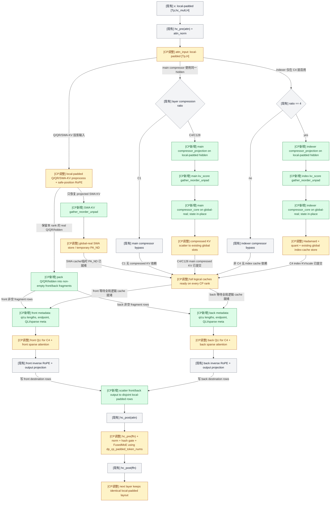
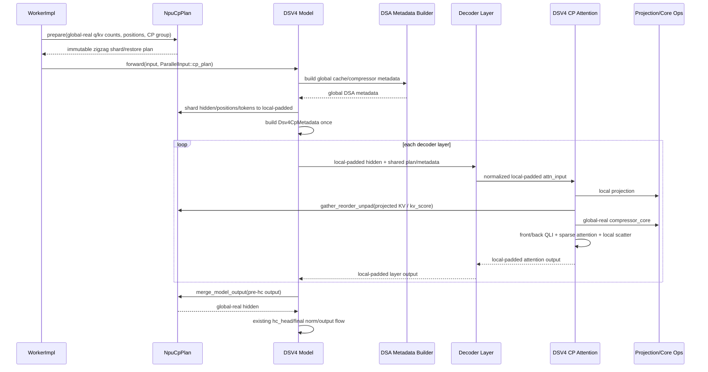

# DeepSeek V4 NPU Context Parallel Pre-Compressor 设计

## 1. 文档结论

本文给出 DeepSeek V4（DSV4）在 xLLM NPU model-side Context Parallel（CP）
框架上的 prefill 设计。第一版同时覆盖：

- target model full prefill；
- target model chunked prefill；
- prefix cache 场景；
- MTP prefill；
- CP 嵌套在 DP replica 内的 DP + CP + EP 衔接。

方案遵守以下已确定约束：

1. 输入继续使用现有 `2 * cp_size` block zigzag 切分和 local-padded 布局。
2. 输出继续复用 `NpuCpPlan::merge_model_output()` 的 gather、原序恢复和 unpad
   语义。
3. DSV4 cache 不做 KV split，要求 `kv_split_size_effective == 1`；每个 CP rank
   维护完整逻辑 cache 和 compressor state。
4. compressor 必须拆为 projection-only 和 compressor core。本地 padded hidden
   先做 projection，只 all-gather `kv_score`，恢复 global-real 顺序后再做 core。
5. main compressor 和 C4 indexer compressor 权重独立，projection、all-gather 和
   core 分别执行。
6. prefix cache 不进入 DSV4 CP plan 或新算子的接口。由于 cache 没有按 CP 切分，
   CP 层只复用现有 DSV4 prefix/cache 语义。
7. 第一版不做计算通信 overlap，不支持 CP + ACL graph；decode 和非 CP 路径继续
   使用现有 fused compressor。

核心数据流如下：

```text
global-real model input
  -> existing NpuCpPlan zigzag shard
  -> local-padded hidden
  -> local-padded q/qr/kv/compressor projection
  -> projected SWA KV: gather/reorder/unpad -> global cache update
  -> kv_score: gather/reorder/unpad -> compressor core -> global cache update
  -> local front/back QLI + sparse attention
  -> local-padded decoder output
  -> after last layer: existing merge_model_output
  -> hc_head/final norm and model outputs
```

## 2. SGLang upstream 调研

调研基于 SGLang upstream commit
`b79388f33856d40a40dfb622c05cedb131637d61`，主要代码包括：

- `python/sglang/srt/layers/attention/dsv4/compressor.py`
- `python/sglang/srt/models/deepseek_v4.py`
- `python/sglang/srt/layers/attention/deepseek_v4_backend.py`
- `python/sglang/srt/layers/utils/cp_utils.py`
- `test/registered/cp/test_deepseek_v4_flash_fp4_b200_cp.py`

对应 upstream 入口：

- [DSV4 CP PR #23882](https://github.com/sgl-project/sglang/pull/23882)
- [DSV4 NPU PR #23601](https://github.com/sgl-project/sglang/pull/23601)
- [DSV4 compressor](https://github.com/sgl-project/sglang/blob/main/python/sglang/srt/layers/attention/dsv4/compressor.py)
- [DSV4 model](https://github.com/sgl-project/sglang/blob/main/python/sglang/srt/models/deepseek_v4.py)
- [CP utilities](https://github.com/sgl-project/sglang/blob/main/python/sglang/srt/layers/utils/cp_utils.py)

### 2.1 Upstream 的关键语义

SGLang DSV4 CP 不是在每个 rank 上先做局部 compressor，再拼 compressed token。
它采用完整 cache/state 副本语义：

1. query 保持 CP rank 本地。
2. compressor projection 先在本地执行。
3. `compute_kv_score()` 在 state recurrence 之前 all-gather `kv_score` 并恢复全局
   token 顺序。
4. 每个 CP rank 对相同的全局输入执行 compressor core，产生相同的 compressed KV
   和 state 更新。
5. projected SWA KV 也在写 cache 前恢复全局顺序。
6. QLI 和 sparse attention 只处理本地 query，但读取完整 cache。
7. attention output 保持本地，模型边界再恢复原始 token 顺序。

SGLang CUDA/native 路径的 `Compressor::compute_kv_score()` 先执行无 bias 的
`linear_bf16_fp32(x, wkv_gate.weight)`，然后调用
`cp_all_gather_rerange_output()`。这说明 projection 本身无状态，compressor 的 state
递推从 `kv_score` 之后才开始。

SGLang 当前 NPU fused compressor 接口仍把 projection 包在 compressor 内，因此 NPU
分支在 CP 下 gather hidden。xLLM 本设计采用 native 路径的数据边界，将 projection
拆出，只 gather `kv_score`，避免传输完整 hidden。

### 2.2 Zigzag attention 语义

SGLang 的 in-sequence CP 将一个 sequence 分为 `2P` 个 block，rank `r` 持有 block
`r` 和 block `2P - 1 - r`。两个 fragment 在原序中不连续，不能合并成一段连续 query。

其 `cp_attn_forward_extend()` 为前、后 fragment 分别构建 query lengths 和 causal KV
边界，分别调用 attention，再恢复本地输出。xLLM 保留自己的 zigzag 物理布局，只复用
这项 half-wise attention 语义。

### 2.3 Upstream 结论的边界

SGLang 当前 DSV4 CP 回归主要覆盖 CUDA/B200。其 NPU 分支展示了 fused compressor 前
gather hidden 的接口选择，但不能作为 xLLM Ascend 全流程已经验证的证明。因此本文把
SGLang 用作计算顺序和数据契约参考，Ascend 实现仍需独立闭环。

## 3. xLLM 现状与设计差距

### 3.1 可复用能力

现有 `NpuCpPlan` 已提供：

- per-sequence `2P` block zigzag 规划；
- global-real 到 local-padded 的 source/destination indices；
- 各 CP rank 等行数 padding，满足固定 shape collective；
- rank-major gathered rows 到 global-real 的 restore indices；
- `merge_model_output()` 的 all-gather、重排和 unpad；
- CP/EP 衔接 metadata 和 process group 绑定。

DSV4 不应创建第二套 CP plan。需要扩展的是通用 row 操作和 DSV4 typed metadata，
而不是改变现有 plan 的 zigzag 规则。

### 3.2 当前缺口

当前 DSV4 NPU 路径还存在以下差距：

- `DeepseekV4ModelImpl` 和 `DeepseekV4MtpModelImpl` 尚未完整消费 `cp_plan`；
- DSA metadata 当前按单一连续 query 构建，不包含 zigzag front/back 两套 causal
  metadata；
- `DSAttentionImpl::forward()` 将 preprocess、cache store、compressor、indexer、
  QLI 和 sparse attention 串在一起，缺少 CP 所需的阶段边界；
- 当前 `aclnnCompressor` 把 projection 和 core 融在一起，无法只 gather
  `kv_score`；
- `DeepseekV4IndexerImpl::select_qli()` 同时更新 index cache 和执行 query-side QLI；
- DSV4 main/MTP 的 `dp_local_tp_size_` 使用 `world_size / dp_size`，未排除 CP 维；
- FusedMoE 的 DP gather/slice 使用 `dp_global_token_nums`，不能表达 CP local-padded
  行数；
- capability registry 和 runtime gate 尚未形成 DSV4 target/MTP 的第一版能力边界。

另外，`NpuCpPlan::prepare()` 当前会把通用 attention lengths 改写为 CP-local 视图，
而 DSV4 global cache/compressor metadata 必须使用改写前的 q/kv lengths。实现时需要在
通用 plan 中保留只读的 global q/kv sequence length 快照，或在改写前向 DSV4 builder
传入等价快照。该快照仍是模型无关的 token count，不增加 prefix-cache 专用字段。

## 4. 数据视图与不变量

设 CP size 为 `P`。对每个 sequence 的本次 query segment，沿用当前 plan：

```text
global: [B0, B1, ..., B(P-1), BP, ..., B(2P-1)]
rank r: [Br, B(2P-1-r)] + local padding
```

xLLM DSV4 CP 同时维护三种 token 视图：

| 视图 | dim-0 行数 | 顺序 | 用途 |
| --- | ---: | --- | --- |
| local padded | CP 组内固定相同 | 当前 `[seq0.front, seq0.back, ...]` + pad | decoder、projection、MoE、collective 输入 |
| half packed real | 当前 half 的非空真实 token | `[seq0.half, seq1.half, ...]` | QLI、sparse attention |
| global real | CP 切分前真实 token 总数 | 原始 batch token 顺序 | cache 写入、compressor core |

必须保持以下不变量：

1. decoder layer 外部始终使用当前 local-padded 物理布局。
2. q、qr、projected SWA KV 和 compressor projection 都可在 local-padded 行上计算。
3. pad position 使用安全值，例如 0，不能使用越界虚拟 position。
4. pad projection 结果只用于固定 shape collective，必须在进入 cache、compressor
   core、QLI 或 sparse attention 前由 restore/unpad indices 删除。
5. cache block table、slot mapping 和 compressor state 保持 CP 切分前的 global
   sequence 语义。
6. attention 返回 local-padded shape，HC recurrence、FFN 和 MoE 不感知 front/back
   细节。
7. 每个 CP rank 都维护完整逻辑 SWA KV、compressed KV、index KV 和 compressor
   state；不指定 state owner，不广播尾 state。
8. `kv_split_size_effective == 1`。

## 5. 通用 CP 接口扩展

### 5.1 `gather_reorder_unpad`

在 `NpuCpPlan` 中新增统一的层内恢复接口：

```cpp
torch::Tensor gather_reorder_unpad(
    const torch::Tensor& local_padded_tensor) const;
```

接口契约：

- `local_padded_tensor.dim() >= 1`；
- dim 0 必须等于 `local_padded_token_count()`；
- 尾部维度任意且在 CP 组内一致；
- 在 dim 0 上执行固定 shape all-gather；
- 使用现有 `output_restore_indices` 恢复 global token 原序并删除 padding；
- 返回 dim 0 等于 `global_real_token_count()` 的 global-real tensor；
- CP 关闭时原样返回输入；
- 第一版为同步接口，不承诺通信计算 overlap。

projected SWA KV、main `kv_score` 和 indexer `kv_score` 都调用这个接口。DSV4
attention 不维护另一套 all-gather/reorder/unpad indices。

`merge_model_output()` 保留当前模型边界语义，可复用
`gather_reorder_unpad()` 的底层实现，但对外名称和调用位置不变。

### 5.2 通用 row shard

补充能处理任意尾部维度的 row shard/pack 能力，使 hidden、positions、tokens 和 MTP
融合后的输入严格使用同一份 plan。逻辑接口可以是：

```cpp
torch::Tensor shard_rows(const torch::Tensor& global_real,
                         const Scalar& pad_value) const;
```

现有 `shard_model_input()` 可以继续作为 hidden/position wrapper。DSV4 不修改 plan 的
local physical layout，也不要求通用 plan 理解 compressor、QLI 或 prefix cache。

## 6. Model 和 Decoder 计算流程

### 6.1 Target model

target prefill 流程调整为：

1. 基于 CP 切分前的 q/kv lengths、positions、multi block tables 和 slot mappings
   构建 global DSA cache metadata。
2. embedding 后、HC expansion 前，使用同一 `NpuCpPlan` 切分 hidden、positions 和
   tokens。
3. hidden 扩为当前 HC local-padded layout。
4. 从 global DSA metadata 和 plan indices 构建一次 `Dsv4CpMetadata`，所有 decoder
   layer 复用。
5. decoder layer 全程保持 local-padded layout；attention 内部临时建立 front/back
   real views 和 global-real cache/compressor views。
6. 最后一个 decoder layer 完成后，对 pre-`hc_head` hidden 调用一次现有
   `merge_model_output()`。
7. 在 global-real hidden 上保存 speculative aux hidden，再按当前顺序执行 `hc_head`
   和 final norm。

将 merge 放在 `hc_head` 前，可以用一次 collective 同时满足最终输出和 target
aux-hidden 的全局顺序要求，避免分别 gather hidden/residual/aux。

### 6.2 Decoder layer 边界

现有 layer 顺序保持不变：

```text
hc_pre(attn)
  -> attn_norm
  -> DSAttention
  -> hc_post(attn)
  -> hc_pre(ffn)
  -> ffn_norm / hash gate / FusedMoE
  -> hc_post(ffn)
```

CP 适配位于 normalized attention input 和 `DSAttention` 内部。attention output 按
half destination indices 写回当前 local-padded rows，pad rows 保持占位；layer 外的
HC、hash gate 和 FFN 不改变数据布局。

### 6.3 MTP prefill

第一版必须支持 DSV4 MTP prefill，并复用 target forward 已构建的同一份
`NpuCpPlan`：

1. 先按当前 MTP 语义完成 token embedding 与 previous hidden 的 predictor fusion。
2. fusion 完成后，再用 target plan 切分 fused hidden、positions 和 tokens。
3. MTP decoder 使用与 target 相同的 DSV4 CP attention/compressor 路径。
4. 最后一个 MTP layer 后恢复 global-real 输出，再按当前语义执行 final norm。
5. 若同时需要 post-HC hidden 和 pre-HC aux hidden，可先沿 feature 维打包并通过一次
   `merge_model_output()` 恢复，再拆分，避免重复输出 collective。

MTP 只复用 plan，不重新规划 token owner 或 padding。MTP prefill 的 compressor 同样走
projection -> gather -> core；MTP decode 不启用 CP。

## 7. 每层 DSV4 Attention 计算流

### 7.1 Local-padded preprocess

对 local-padded normalized hidden 执行当前 preprocess，得到：

- `q_local_padded`；
- `qr_local_padded` 和 per-token scale；
- `swa_kv_local_padded`；
- main compressor 的 `kv_score_local_padded`；
- C4 indexer compressor 的 `index_kv_score_local_padded`。

真实 token 使用 local absolute positions；pad row 使用安全 position 0。projection
阶段是逐行无状态计算，因此允许处理 pad row。pad row 不得进入后续有状态或 cache
相关计算。

### 7.2 Projected SWA KV

SWA 路径只 gather projected KV，不 gather hidden：

```text
swa_kv_local_padded
  -> cp_plan.gather_reorder_unpad()
  -> swa_kv_global_real
  -> existing global SWA cache/store flow
```

- full prefill 继续用 global-real KV 构造 temporary PA_ND cache；
- chunked prefill 继续按 global SWA slots 写 persistent cache，并读取已有 prefix KV；
- 每个 CP rank 都执行相同逻辑写入，但物理 block id 可以不同；
- C1 层不调用 compressor，只执行 SWA KV 恢复和 local front/back attention。

### 7.3 C4/C128 main compressor

main compressor 路径为：

```text
local-padded hidden
  -> compressor_projection(main weights)
  -> main_kv_score_local_padded
  -> cp_plan.gather_reorder_unpad()
  -> main_kv_score_global_real
  -> compressor_core(main states/global metadata)
  -> compressed_kv_global
  -> existing cmp_slot scatter
```

每个 rank 对相同的 global-real `kv_score` 分别执行 core，并原地更新自己的完整
`kv_state/score_state` 副本。不需要 hidden all-gather、C4 halo、compressed row
all-gather 或跨 rank state 同步。

### 7.4 C4 indexer compressor

C4 indexer compressor 有独立权重和独立 state，不能与 main compressor 合并：

```text
local-padded hidden
  -> compressor_projection(indexer weights)
  -> index_kv_score_local_padded
  -> cp_plan.gather_reorder_unpad()
  -> index_kv_score_global_real
  -> compressor_core(indexer states/global metadata)
  -> index_kv_global
  -> hadamard / dynamic quant / global index cache store
```

第一版接受 main 和 indexer 各自发起一次 `kv_score` all-gather。不要引入 combined
main/index projection 或 combined collective。

`DeepseekV4IndexerImpl` 需要拆出：

- global index cache update 阶段；
- local half query 构建和 QLI 阶段。

非 CP wrapper 可以继续按当前顺序组合调用，避免影响 decode 和非 CP 路径。

### 7.5 Front/back QLI 和 sparse attention

当前 local-padded 物理顺序保持为：

```text
[seq0.front, seq0.back, seq1.front, seq1.back, ...]
```

attention 前使用 `Dsv4CpMetadata` 的 indices 临时 pack：

```text
front = [seq0.front, seq1.front, ...]
back  = [seq0.back,  seq1.back,  ...]
```

front/back 分别执行 attention。当前 C4 分支的两个 half 各调用一次 QLI 和一次 sparse
attention；C1/C128 不调用 QLI，但仍分别调用两次 sparse attention：

```text
for half in [front, back]:
  if half has no real fragment:
    skip QLI and sparse attention
  else:
    if ratio == 4:
      topk_half = QLI(q_index_half, full_index_cache, half_metadata)
    out_half = sparse_attention(
        q_half,
        full_swa_cache,
        full_compressed_cache,
        optional(topk_half),
        half_metadata)
    index_copy(out_local_padded, half_destination_indices, out_half)
```

长度为 0 的 fragment 从该 half 的 batch metadata 中过滤；block table rows、q lengths、
cu-seqlens、causal endpoints、QLI metadata 和 C1/C4/C128 sparse metadata 必须使用
同一过滤结果。整个 half 没有真实 fragment 时跳过对应 QLI 和 sparse 调用，但所有 CP
rank 仍须参与此前固定 shape 的 projection 后的 collective。

对 sequence `i`：

```text
prefix_i = kv_len_i - global_q_len_i
kv_endpoint = prefix_i + fragment_offset + fragment_len
```

front/back 各自保存独立 endpoint，不能用 `front_len + back_len` 伪装连续 query。
attention output 直接写回当前 local-padded destination rows，decoder layer 不改变布局。

### 7.6 加入 CP 后的 Layer 内完整数据流

图例：灰色为保持语义不变的现有 layer 流程；黄色为调整输入布局或调用位置的现有
计算；绿色为 CP 新增的 metadata、collective 或 split-compressor 编排。



图中的 main/indexer projection 和 gather 是两条独立支路。`T` 处的多入边表示 attention
执行前的依赖 barrier：SWA、当前 ratio 所需的 main compressed KV，以及 C4 层所需的
index cache 都已就绪；它不表示张量 concat 或相加。`AA` 处的汇聚表示 front/back 输出
scatter 到互不重叠的 destination rows，共同恢复 local-padded buffer，也不执行 reduction。
所有 CP rank 必须先完成固定 shape 的 projection 后的 collective，随后才允许按本 rank
的 non-empty front/back metadata 跳过空 half。第一版各支路按依赖顺序同步执行，不跨
layer overlap。

## 8. 新算子一：`compressor_projection`

### 8.1 职责

`compressor_projection` 只执行逐 token、无 bias 的 compressor projection。它不读取或
更新任何 recurrence state，不执行压缩、APE、norm、RoPE、cache 写入或 collective。

逻辑功能为：

```text
kv_projection = linear(hidden, wkv)
gate_score     = linear(hidden, wgate)
kv_score       = concat([kv_projection, gate_score], dim=-1)
```

推荐实现使用合并权重 `wkv_gate = concat([wkv, wgate], dim=0)`，通过一次 GEMM 产生
相同布局；但不强制要求合并权重。merged `wkv_gate` 和 separate `wkv/wgate` 可以采用
两个接口，具体 ABI 属于算子实现取舍，不是 CP 数据契约。

### 8.2 接口契约

接口可以按权重组织方式分别提供：

```cpp
torch::Tensor compressor_projection(
    const torch::Tensor& hidden,
    const torch::Tensor& wkv_gate,
    int64_t coff);

torch::Tensor compressor_projection(
    const torch::Tensor& hidden,
    const torch::Tensor& wkv,
    const torch::Tensor& wgate,
    int64_t coff);
```

推荐优先实现 merged `wkv_gate` 接口；是否同时提供 separate `wkv/wgate` 接口由算子
实现决定。二者是不同接口形态，不要求通过一个 optional/variant 参数统一。

输入约定：

| 输入 | 必需 | 约定 |
| --- | --- | --- |
| `hidden` | 是 | CP 主路径要求 TH 布局 `[T_local_padded, hidden_size]`；支持 BSH 是建议项，不是第一版强制条件 |
| projection weight | 是 | merged `wkv_gate` 或 separate `wkv/wgate`；两种接口必须产生相同输出布局 |
| `coff` | 是 | C4 overlap 为 2，C128 为 1 |

输出约定：

```text
kv_score.shape = [T_local_padded, 2 * coff * head_dim]
kv_score[..., :coff * head_dim] = kv_projection
kv_score[..., coff * head_dim:] = gate_score
```

因此：

- C4：`coff == 2`，最后一维为 `4 * head_dim`；
- C128：`coff == 1`，最后一维为 `2 * head_dim`。

功能约定：

1. 算子是纯函数，无可变 state。
2. dim 0 行之间无依赖，处理 padding 后的 hidden 与处理真实 hidden 的对应行结果一致。
3. padding row 被当作普通输入行计算；算子不接收 pad mask，也不负责 unpad。
4. 输出必须保持输入 dim 0 顺序和行数，不允许内部 regroup 或压缩。
5. 算子不接收 CP rank、CP group、prefix flag、block table、position 或 cache metadata。
6. main compressor 与 indexer compressor 分别调用，不能隐式共享权重或输出。
7. projection 的精度和 dtype 策略不在本文约束范围内。

### 8.3 调用方责任

调用方必须在 local-padded hidden 上调用 projection，再对返回值执行：

```text
kv_score_global_real = cp_plan.gather_reorder_unpad(kv_score_local_padded)
```

只有 unpad 后的 global-real `kv_score` 可以传给 `compressor_core`。projection 本身不能
把 local-padded row count 误解释为真实 sequence length。

## 9. 新算子二：`compressor_core`

### 9.1 职责

`compressor_core` 承接现有 fused `aclnnCompressor` 中 projection 之后的全部功能：

- 按 `cmp_ratio/coff` 执行 compressor aggregation 和 gate 逻辑；
- 读取 APE；
- 读取并原地更新 `kv_state` 和 `score_state`；
- 应用现有 norm 和 compressed-position RoPE 语义；
- 产生当前调用对应的 `compressed_kv`。

它不执行 projection、collective 或 cache scatter。

### 9.2 接口契约

新接口从当前 `CompressorParams` 删除 `x/wkv/wgate`，以 `kv_score` 替换；其余
inputs、optional metadata 和 attrs 保持现有 fused compressor 语义：

```cpp
struct CompressorCoreParams {
  torch::Tensor kv_score;
  torch::Tensor kv_state;       // mutable, in-place update
  torch::Tensor score_state;    // mutable, in-place update
  torch::Tensor ape;
  torch::Tensor norm_weight;
  torch::Tensor rope_sin;
  torch::Tensor rope_cos;
  c10::optional<torch::Tensor> kv_block_table;
  c10::optional<torch::Tensor> score_block_table;
  c10::optional<torch::Tensor> cu_seqlens;
  c10::optional<torch::Tensor> seqused;
  c10::optional<torch::Tensor> start_pos;
  int64_t rope_head_dim;
  int64_t cmp_ratio;
  int64_t coff;
  double norm_eps;
  int64_t rotary_mode;
};

torch::Tensor compressor_core(CompressorCoreParams& params);
```

输入约定：

| 输入 | 约定 |
| --- | --- |
| `kv_score` | TH global-real 布局 `[T_global_real, 2 * coff * head_dim]`，顺序与 CP 切分前本次 batch 完全一致 |
| `kv_state` | 沿用现有 fused op 的 state layout、block table 寻址和 dtype；同一 storage 原地更新 |
| `score_state` | 沿用现有 fused op 的 state layout、block table 寻址和 dtype；同一 storage 原地更新 |
| `ape` | 沿用当前 ratio/coff/head-dim 约束 |
| `norm_weight` | 沿用当前 compressed KV norm 约束 |
| `rope_sin/rope_cos` | 沿用当前 compressed-position RoPE 行数和 layout |
| block tables、lengths、start positions | 使用 global DSA metadata；语义与当前 fused compressor 完全一致 |
| attrs | `cmp_ratio/coff/rope_head_dim/norm_eps/rotary_mode` 与当前 fused op 一致 |

输出和副作用约定：

1. 仅返回 `compressed_kv`；其 shape、行数和顺序由现有 compressor metadata、ratio
   和 compressed RoPE positions 决定，与当前 fused op 相同。
2. `kv_state` 和 `score_state` 必须保持同一 storage 并原地更新；不能以新 tensor
   替换调用方持有的 state。
3. 仅 metadata 指定的逻辑 state/cache rows 可以被更新。
4. 算子不把 `compressed_kv` scatter 到 cache；调用方继续复用当前 `cmp_slot` 或 index
   slot 写入流程。
5. full prefill、chunked continuation、C4 overlap 和 C128 recurrence 的功能语义与
   当前 fused compressor 保持一致。
6. 算子不接收 CP rank、CP group、pad mask、prefix-cache flag 或 DP metadata。
7. 输入不得包含 local padding row；CP 的 gather/reorder/unpad 必须在调用前完成。

### 9.3 与现有 fused compressor 的等价基线

在 CP=1 时，以下两条路径必须功能等价：

```text
old: hidden -> fused compressor -> compressed_kv/state
new: hidden -> compressor_projection -> compressor_core -> compressed_kv/state
```

等价范围包括 C4、C128、main compressor、indexer compressor、full prefill 和 chunked
continuation，并同时覆盖：

- 返回的 `compressed_kv`；
- `kv_state` 原地更新结果；
- `score_state` 原地更新结果；
- 调用方 scatter 后的 compressed/index cache 内容。

现有 fused `aclnnCompressor` 必须保留，供 decode 和非 CP prefill/chunked 路径继续使用。

调用路由固定为：

| 场景 | Compressor 路径 |
| --- | --- |
| CP target full/chunked prefill | projection -> gather/reorder/unpad -> core |
| CP MTP prefill | projection -> gather/reorder/unpad -> core |
| 非 CP full/chunked prefill | 现有 fused compressor |
| decode | 现有 fused compressor |

## 10. Metadata 设计

新增模型专用 typed `Dsv4CpMetadata`，不要使用匿名 `cp_input_dict` 传 tensor。它由
通用 `NpuCpPlan` 和 global DSA metadata 派生，一次 forward 构建并跨 layer 复用。

### 10.1 `NpuCpPlan` 的职责

通用 plan 继续只负责：

- global/local token counts 和 row indices；
- 当前 zigzag local-padded layout；
- process group；
- `gather_reorder_unpad()`；
- 最终 `merge_model_output()`；
- 通用 CP/EP bridge metadata。

plan 不理解 DSV4 compressor、C1/C4/C128、QLI 或 prefix cache。若需要保存 global
q/kv sequence length 快照，它们也只作为通用 token counts 暴露。

### 10.2 `Dsv4CpMetadata` 的职责

建议结构：

```cpp
struct Dsv4CpHalfMetadata {
  torch::Tensor pack_indices;
  torch::Tensor destination_indices;
  torch::Tensor q_seq_lens;
  torch::Tensor q_cu_seqlens;
  torch::Tensor kv_endpoints;
  torch::Tensor active_sequence_indices;
  torch::Tensor qli_metadata;
  torch::Tensor c1_sparse_metadata;
  torch::Tensor c4_sparse_metadata;
  torch::Tensor c128_sparse_metadata;
  bool empty = false;
};

struct Dsv4CpMetadata {
  Dsv4CpHalfMetadata front;
  Dsv4CpHalfMetadata back;
};
```

具体字段可按现有 metadata builder 类型调整，但必须表达以下信息：

- front/back pack indices 和 local-padded destination indices；
- 每个 half 过滤空 fragment 后的 sequence row mapping；
- 独立 q lengths、cu-seqlens 和 causal KV endpoints；
- front/back 两套 QLI metadata；
- front/back 两套 C1/C4/C128 sparse metadata。

global cache metadata 保持现状：

- global q/kv lengths 和 start positions；
- C4/C128 compressed positions；
- per-layer multi block tables；
- SWA、compressed KV、compressor state、index state 和 index KV slot mappings；
- compressor 使用的 global cumulative lengths。

query-side metadata 本地化，cache-write 和 compressor metadata 保持 global。所有 half
metadata 使用 plan 的真实 source indices 构建，不能假设 stride slice。

## 11. Chunked Prefill 与 Prefix Cache

### 11.1 Chunked prefill

chunked prefill 继续分别执行本次 chunk 的两类全局恢复：

```text
projected SWA KV local-padded
  -> gather/reorder/unpad
  -> global SWA cache update

kv_score local-padded
  -> gather/reorder/unpad
  -> compressor_core(global metadata + existing states)
  -> compressed cache update
```

`compressor_core` 使用现有 `start_pos`、global lengths、block tables 和已持久化 state
延续 recurrence。CP 不增加 halo、partial-state owner 或跨 rank state 接力。

由于 core 输入已经恢复为 global-real 原序，CP 不额外要求 zigzag block 或 chunked
segment 按 4/128 对齐；边界语义继续由现有 compressor metadata 和 state 处理。

### 11.2 Prefix cache

prefix cache 对 DSV4 CP 完全透明：

- CP rank 没有 KV split，每个 rank 已持有完整逻辑 cache/state；
- prefix hit、block table 和 start position 继续由现有 DSV4 metadata/cache manager
  处理；
- `NpuCpPlan` 不新增 DSV4 prefix 字段或 prefix 分支；
- `compressor_projection` 和 `compressor_core` 不接收 prefix flag；
- front/back causal endpoint 只使用现有 `kv_len` 与本次 `global_q_len` 计算。

prefix hit 也不需要为了 CP 回退到 4/128 边界或重算 token。

因此 prefix cache 是现有 DSV4 行为在 CP 下的自然组合，不是新的 CP 数据切分协议。

## 12. DP、CP 与 EP 衔接

第一版支持 DP。拓扑语义为 CP 嵌套在每个 DP replica 内：

```text
attention_tp_size = world_size / (dp_size * cp_size)
```

- attention、SWA gather 和 compressor `kv_score` gather 只在当前 DP replica 的 CP
  group 内执行；
- DSA attention 本身不感知 DP；
- 不同 DP/CP rank 的物理 cache block id 可以不同，只需逻辑 metadata 等价；
- main 和 MTP 的 head shard、linear TP group 及 `dp_local_tp_size_` 都必须排除 CP 维。

DP -> EP 边界新增：

```text
dp_cp_padded_token_nums[dp_rank]
```

字段语义：每个 DP replica 在当前 CP rank 上实际送入 MoE 的 local-padded 行数。它与
现有 `dp_global_token_nums` 分工如下：

| 字段 | 语义 | 使用方 |
| --- | --- | --- |
| `dp_global_token_nums` | CP 切分前每个 DP replica 的 global-real token 数 | scheduler、cache 和原有全局语义 |
| `dp_cp_padded_token_nums` | CP 切分后每个 DP replica 的 local-padded/dummy 行数 | FusedMoE DP gather、EP dispatch、结果 slice |

CP 开启时，FusedMoE 的 hidden、topk weights、topk ids gather 以及 combine 后 slice 都
使用 `dp_cp_padded_token_nums`。空 DP rank 沿用当前 dummy-row 策略，该字段记录实际
发送的 dummy padded rows，而不是 0。target 和 MTP 使用相同规则。

## 13. 通信与执行边界

每层同步通信如下：

| layer 类型 | projected SWA KV | main `kv_score` | indexer `kv_score` |
| --- | ---: | ---: | ---: |
| C1 | 1 次 | 0 | 0 |
| C4 | 1 次 | 1 次 | 1 次 |
| C128 | 1 次 | 1 次 | 0 |

不通信以下数据：

- normalized hidden；
- q/qr；
- compressed KV output；
- index KV output；
- `kv_state/score_state`。

第一版所有 collective 按上述顺序同步完成，不做 projection、main/index compressor、
QLI 或 sparse attention 的跨 stream overlap。

运行边界：

- CP 仅用于 target/MTP prefill 类 forward；
- decode 和非 CP 路径保留当前执行流；
- CP + ACL graph 在启动或 capability 检查阶段直接拒绝；
- `kv_split_size_effective != 1` 时拒绝 DSV4 CP。

## 14. 当前 NPU CP 框架接入指导

### 14.1 现有生命周期与代码锚点

DSV4 必须接入现有 model-side CP 生命周期，不在 model 或 layer 内重新构建第二套
zigzag plan：

```text
Master::validate_model_cp
  -> ModelRegistry CP capability
  -> WorkerImpl::npu_cp_plan_runtime_config
  -> WorkerImpl::prepare_work_before_execute_on_stream
  -> NpuCpPlan::prepare
  -> ParallelInput::cp_plan
  -> DeepseekV4ModelImpl / DeepseekV4MtpModelImpl
  -> decoder layers
  -> NpuCpPlan::merge_model_output
```

当前代码锚点和新增职责如下：

| 生命周期节点 | 当前代码锚点 | DSV4 CP 接入职责 |
| --- | --- | --- |
| 启动校验 | `xllm/core/distributed_runtime/master.cpp::validate_model_cp` | 按 capability 校验 Torch backend、DP、graph 和 KV split |
| 模型能力注册 | `xllm/models/model_registry.cpp::is_npu_model_cp_capable` | 注册 `deepseek_v4`、`deepseek_v4_mtp` 及其能力差异 |
| worker 配置 | `xllm/core/runtime/worker_impl.cpp::npu_cp_plan_runtime_config` | 绑定 CP group、DP group、设备和 model-managed DSA policy |
| forward 级 plan | `xllm/core/framework/parallel_state/npu_cp_plan.cpp::NpuCpPlan::prepare` | 构建现有 zigzag shard/restore，并保留 global q/kv counts |
| plan 传递 | `xllm/core/framework/model/model_input_params.h::ParallelInput` | 将只读 plan 和 `dp_cp_padded_token_nums` 传入 model/layer |
| target model | `xllm/models/llm/deepseek_v4.h::DeepseekV4ModelImpl::forward` | global DSA metadata、row shard、跨 layer plan 复用和单次 output merge |
| MTP model | `xllm/models/llm/deepseek_v4_mtp.h::DeepseekV4MtpModelImpl::forward` | predictor fusion 后复用 target plan shard |
| decoder 挂接点 | `xllm/core/layers/deepseek_v4_decoder_layer.cpp::forward` | 在 normalized `attn_input` 处选择 CP attention 路径 |
| DSA 编排 | `xllm/core/layers/npu_torch/deepseek_sparse_attention.cpp::DSAttentionImpl::forward` | 拆出 local preprocess、三条恢复支路和 half attention |
| DP/EP bridge | `xllm/core/layers/npu_torch/fused_moe.cpp` | CP 下改用 `dp_cp_padded_token_nums` |

接入后的 forward 时序为：



### 14.2 Capability 与启动门禁

当前框架有两个不能仅靠加入模型名解决的门禁：

1. `deepseek_v4/deepseek_v4_mtp` 在 registry 中是 Torch-only model，而当前 NPU CP
   启动校验统一要求 effective backend 为 ATB。
2. `validate_model_cp()` 当前统一拒绝 `dp_size != 1`，而 DSV4 第一版要求支持 DP。

建议把当前单一的 `is_npu_model_cp_capable()` 布尔能力扩展为 model registration
提供的 typed capability，例如：

```cpp
struct NpuModelCpCapability {
  NpuCpAttentionKind attention_kind;
  std::string required_backend;
  bool supports_dp;
  bool requires_full_kv_replica;
  bool supports_mtp_prefill;
};
```

DSV4 target/MTP 注册值应表达：

```text
attention_kind          = MODEL_MANAGED_DSA
required_backend        = TORCH
supports_dp             = true
requires_full_kv_replica = true
supports_mtp_prefill    = true
```

`validate_model_cp()` 使用 capability 做以下校验：

- 允许 DSV4 使用 Torch backend，同时保留已有 ATB CP 模型的 backend 限制；
- DSV4 允许 `dp_size > 1`，其他尚未声明支持 DP 的模型继续保留原限制；
- DSV4 强制 `kv_split_size_effective == 1`，不能只校验它是 `cp_size` 的因子；
- 保留 `world_size % (dp_size * cp_size) == 0`；
- 保留 CP + graph 拒绝和 PREFILL/DEFAULT role 限制；
- decode 仍由 `NpuCpPlan::prepare()` 的现有 prefill-only 分支绕过。

model 名称和 backend 差异应在 registry/capability 层消解。`npu_cp_plan.cpp`、新算子和
collective 接口中不能直接比较 `model_type == "deepseek_v4"`。

### 14.3 Worker prepare 接入

当前 `WorkerImpl::prepare_work_before_execute_on_stream()` 的关键顺序是：

```text
ForwardInput::to(device)
  -> empty DP/EP shard dummy row
  -> KV block swaps
  -> existing chunked/prefix input preparation
  -> NpuCpPlan::prepare
  -> model_executor_->forward
```

该 owner 关系保持不变。DSV4 增量要求：

1. `CpPlanRuntimeConfig` 携带 model-independent 的 attention/cache policy，例如
   `MODEL_MANAGED_DSA`，并绑定当前 DP replica 内的 CP group。
2. `NpuCpPlan::prepare()` 使用改写前的 global-real q lengths、kv lengths 和 positions
   构建 shard/restore plan，并保留 DSV4 metadata builder 后续需要的通用 global
   count 快照。
3. `MODEL_MANAGED_DSA` policy 下，不调用面向普通 attention 的
   `prepare_cache_slots()` 去改写 DSV4 multi-cache slots。
4. `MODEL_MANAGED_DSA` policy 下，不能用 `apply_attention_meta()` 覆盖 model 内
   `DSAMetadataBuilder` 尚未消费的 global q/kv lengths；local query lengths 由随后构建的
   `Dsv4CpMetadata` 承载。
5. `prepare()` 只生成 layout、indices 和 process-group binding，不执行任何 layer
   projection、all-gather、compressor 或 cache write。
6. chunked/prefix 的现有 worker preparation 保持原顺序；DSV4 CP 不增加 prefix-cache
   专用 hook。

上述 policy 是通用框架枚举，不把 compressor 或 prefix 细节放入 `NpuCpPlan`。

### 14.4 Global DSA Metadata 与 Local CP Metadata

worker 已经在 model forward 前构建 plan，但 DSV4 的 global cache metadata 仍由 model
内当前 `DSAMetadataBuilder` 负责。model 必须按以下顺序消费两类 metadata：

```text
preserved global q/kv counts + global positions + multi block tables
  -> DSAMetadataBuilder
  -> Global DSAMetadata: cache slots, block tables, compressor states/positions

NpuCpPlan indices + Global DSAMetadata
  -> Dsv4CpMetadata builder
  -> front/back local query execution metadata
```

`Global DSAMetadata` 不按 CP rank 切分；`Dsv4CpMetadata` 只描述本 rank 的 query pack、
destination、causal endpoint、QLI 和 sparse metadata。后者一次 forward 构建并跨 layer
复用，不能在每层从 tensor shape 临时反推 fragment。

不要把 `Dsv4CpMetadata` 塞入 `NpuCpPlan`，也不要用 `cp_input_dict` 字符串 key 传递。
推荐在 `AttentionMetadata` 中增加 typed optional/shared object，或由 model 以明确参数传给
decoder layer。

### 14.5 Target Model 接入顺序

`DeepseekV4ModelImpl::forward()` 按以下顺序调整：

```text
1. 接收 global-real tokens/positions 和 worker 已准备的 cp_plan
2. embedding 得到 global-real [T,H]
3. 使用 preserved global q/kv inputs 构建 Global DSAMetadata
4. cp_plan.shard_rows(tokens, pad=0)
5. cp_plan.shard_model_input(hidden, positions)，pad position 使用 0
6. 构建一次 Dsv4CpMetadata
7. local-padded hidden 扩展为 [Tp,hc_mult,H]
8. 所有 decoder layer 复用同一 plan 和 Dsv4CpMetadata
9. 最后一层后 merge pre-hc hidden 为 global-real
10. 保存 target aux，执行现有 hc_head 和 final norm
11. 返回 global-real ModelOutput
```

tokens 必须与 hidden 使用完全相同的 source/destination indices，否则 hash gate 会把
global token id 与 local-padded hidden 错行配对。`shard_rows()` 需要支持 1-D tokens 和
任意 trailing dimensions，现有 `shard_model_input()` 可继续作为 2-D hidden/position
wrapper。

输出 merge 的位置固定在最后一个 decoder layer 与 `hc_head/final norm` 之间。不要采用
参考草案中“先 local hc_head/norm，再分别 merge final/aux”的路径。

### 14.6 Decoder 与 DSAttention 挂接点

`DeepseekV4DecoderLayerImpl::forward()` 已同时持有 normalized `attn_input`、
`ModelInputParams` 和 DSA metadata，是选择 CP 路径的自然位置：

```cpp
const NpuCpPlan& cp_plan = input_params.parallel.cp_plan;
if (cp_plan.enabled()) {
  attn_output = attention_->forward_cp(dsa,
                                       dsv4_cp_metadata,
                                       cp_plan,
                                       attn_input,
                                       kv_cache,
                                       kv_state,
                                       is_prefill,
                                       is_chunked_prefill);
} else {
  attn_output = attention_->forward(/* existing arguments */);
}
```

推荐在 `DSAttentionImpl` 内新增 `forward_cp()`，并从当前 `forward()` 抽取 phase methods，
而不是复制权重或复制整个 attention 实现：

```text
preprocess_local_padded_q_qr_kv
project_main_compressor
project_indexer_compressor
restore_and_store_global_swa
run_main_compressor_core_and_store
run_indexer_compressor_core_and_store
run_half_qli_and_sparse_attention
project_and_scatter_half_output
```

这样 `DSAttentionImpl` 继续拥有 q/kv、compressor、indexer 和 output projection 权重；
CP adapter 只负责 tensor/metadata 编排。非 CP `forward()` 和 decode 不改变路由。

### 14.7 Plan、Adapter、算子与 Cache 的职责边界

| 组件 | 负责 | 不负责 |
| --- | --- | --- |
| `NpuCpPlan` | zigzag row mapping、process group、`shard_rows()`、`gather_reorder_unpad()`、最终 merge | DSV4 ratio、compressor state、QLI、prefix cache |
| `Dsv4CpMetadata` | front/back pack/scatter、active sequence rows、q/cu lengths、endpoints、QLI/sparse metadata | collective、projection、cache 写入 |
| `DSAttentionImpl::forward_cp` | 调用 projection/collective/core、cache commit、half attention 和输出 scatter | 重新规划 token owner |
| `compressor_projection` | local-padded 逐行 projection | state、unpad、collective |
| `compressor_core` | global-real compressor 与 state 原地更新 | CP、DP、cache scatter |
| DSV4 cache manager | global logical slots/block tables 和每 rank 物理存储 | query sharding |
| `FusedMoE` | 使用 CP 后的 DP token counts 完成 dispatch/combine | attention metadata |

`gather_reorder_unpad()` 是唯一层内 CP 恢复接口。adapter 不自行重算 owner/reorder
indices，也不新增 main/indexer 专用 collective 算子。

### 14.8 DP/EP Bridge 接入

当前 worker 的 `DpEpPadding` 构建分支在 `cp_size > 1` 时被跳过，且发生在
`NpuCpPlan::prepare()` 之前。DSV4 DP + CP 需要增加 prepare 后分支：

```text
cp_plan.prepare()
  -> local_padded_token_count
  -> fixed cp_rank/tp_rank DP group all-gather
  -> dp_cp_padded_token_nums
  -> CP-aware DpEpPadding / FusedMoE metadata
```

具体改动：

- `CpPlanRuntimeConfig` 增加 non-owning DP group，或调用现有 parallel state helper；
- `ParallelInput` 增加 `dp_cp_padded_token_nums`，`to(device)` 保留该 host vector；
- `dp_size == 1` 时直接写当前 `local_padded_token_count`，不发 DP collective；
- 空 DP rank 延续 worker/model 的 dummy-row 逻辑，写入实际 execution row count；
- `FusedMoE::forward()`、`forward_with_selected_experts()` 以及 dispatch/combine 相关路径
  在 CP enabled 时统一选择 `dp_cp_padded_token_nums`；
- `dp_global_token_nums` 保持 CP 前 global-real 语义，不得被覆盖。

attention 和 compressor 仍只在各 DP replica 内的 CP group 运行；只有 DP -> EP bridge
读取新字段。

### 14.9 MTP Plan 复用接入

当前 `MTPWorkerImpl::owns_npu_cp_plan_build() == false` 只表示 composite worker 不调用
`prepare()`；target/draft leaf worker 默认仍会各自 prepare。第一版 DSV4 MTP 的契约是
复用 target plan，不能依赖两次独立规划“碰巧等价”。

建议在 MTP 内部 handoff 中传递 target forward 的 immutable plan/layout handle：

1. target leaf 基于原始 global-real prefill 输入准备 plan；
2. target 输出 aux 后，MTP orchestration 将同一 plan 的布局和 device metadata 附加到
   draft/MTP `ForwardInput`；
3. draft leaf 检测到预绑定 plan 后跳过重新 build，只用本 leaf 的 CP process group
   重新绑定 non-owning group pointer；
4. shifted MTP tokens、positions 和 target aux 使用该 plan 的同一 row mapping；
5. `DeepseekV4MtpModelImpl` 先完成 predictor fusion，再对 fused hidden 执行 plan shard；
6. 所有 MTP layers 复用该 plan 和同一份 `Dsv4CpMetadata`。

plan handoff 是 runtime 内部对象，不进入用户可见 `ModelOutput`。如果直接共享 C++ 对象
不适合当前 worker ownership，可共享 immutable layout/device tensors 并在 draft leaf
重建薄 wrapper；不能根据 shifted tensor 再运行一遍 zigzag planner。

### 14.10 Model Output 接入

target model 在最后一个 decoder layer 后执行：

```text
local-padded pre-hc hidden
  -> cp_plan.merge_model_output()
  -> global-real pre-hc hidden
  -> save speculative aux when needed
  -> existing hc_head
  -> existing final norm
  -> ModelOutput
```

MTP 若同时需要 post-HC hidden 和 pre-HC aux，可以先沿 feature 维打包，通过一次
`merge_model_output()` 恢复后再拆分。`LLMWorkerImpl` 的 global
`selected_token_idxes`、LM head 和 sampler 必须只消费 merge 后的 global-real output。

任何 layer 内 attention output 都不能调用 `merge_model_output()`；它只 scatter 回
local-padded rows 并进入下一层。

## 15. 需要修改的模块

| 文件/模块 | 主要改动 |
| --- | --- |
| `xllm/core/distributed_runtime/master.cpp` | `validate_model_cp()` 改为消费 typed capability；允许 DSV4 Torch + DP，强制 KV split 为 1 |
| `xllm/models/model_registry.cpp` | 注册 DSV4 target/MTP CP capability 及 backend/DP/full-KV 约束 |
| `xllm/core/runtime/worker_impl.cpp` | 注入 model-managed DSA policy；CP prepare 后构建 DP/EP padded counts |
| `xllm/core/runtime/mtp_worker_impl.cpp` | target 到 draft/MTP 的 immutable plan/layout handoff，避免独立重规划 |
| `xllm/core/framework/parallel_state/npu_cp_plan.*` | 新增通用 `gather_reorder_unpad()` 和任意 trailing-dim row shard；保留构建 DSV4 global metadata 所需的通用 global q/kv counts |
| `xllm/core/framework/model/model_input_params.h` | 增加 `dp_cp_padded_token_nums` 并完成设备/运行时传递 |
| `xllm/core/layers/common/dsa_metadata.*` | 新增 typed `Dsv4CpMetadata`/half metadata |
| `xllm/core/layers/common/dsa_metadata_builder.*` | 从 global DSA metadata + plan 构建 front/back metadata，并过滤空 fragment |
| `xllm/models/llm/deepseek_v4.h` | target capability、输入 shard、单次输出 merge、TP size、DP token metadata |
| `xllm/models/llm/deepseek_v4_mtp.h` | predictor fusion 后复用 target plan shard；接入同一 attention/compressor 和输出 merge |
| `xllm/core/layers/deepseek_v4_decoder_layer.cpp` | 在 normalized `attn_input` 处选择 `forward_cp()`，其余 HC/FFN 主干保持不变 |
| `xllm/core/layers/npu_torch/compressor.*` | 增加 projection/core wrapper；CP 路由走 split path，保留 fused path |
| `xllm/core/kernels/param.h`、NPU ops API | 增加 projection/core params 和接口，重点落实第 8、9 节契约 |
| `third_party/xllm_ops/.../compressor` 相关实现 | 按选定实现方式提供 projection/core 能力；具体算子交付形态不在本文规定 |
| `xllm/core/layers/npu_torch/deepseek_sparse_attention.*` | local-padded preprocess、SWA gather、split compressor、front/back 两次 attention |
| `xllm/core/layers/npu_torch/deepseek_v4_indexer.*` | 分离 global index cache update 与 local half QLI |
| `xllm/core/layers/npu_torch/fused_moe.*` | CP 下使用 `dp_cp_padded_token_nums` 做 DP/EP gather 和 slice |

不要修改普通 attention 的 `prepare_cache_slots()` 来承载 DSV4 多 cache 语义。DSV4
继续由自身的 global multi block tables 和 slot mappings 管理 cache。

## 16. 建议实施顺序

### Phase 1：通用 CP 数据视图和 DSV4 metadata

- 新增任意尾部维度 row shard 和 `gather_reorder_unpad()`；
- 保留 global q/kv count 快照；
- 构建一次性 `Dsv4CpMetadata`；
- 生成 front/back pack/destination indices、causal endpoints 和空 fragment 过滤结果。

### Phase 2：两个 compressor 算子边界

- 落实 `compressor_projection` 的无状态 projection 和固定输出布局；
- 落实 `compressor_core` 的 global-real 输入、原地 state 更新和现有 recurrence 语义；
- 让 split path 在 CP=1 下与 fused compressor 等价；
- 保留原 fused compressor 路由。

### Phase 3：Target attention CP

- embedding 后、HC expansion 前按现有 zigzag plan shard；
- q/qr/KV/projection 在 local-padded layout 上执行；
- SWA KV 和两个 `kv_score` 分别 gather/reorder/unpad；
- front/back 分别调用 QLI/sparse attention 并写回 local-padded rows；
- 最后一层后单次 merge，再执行 hc_head/final norm。

### Phase 4：Chunked prefill、prefix cache 和 MTP

- chunked prefill 接入现有 global state/cache continuation；
- prefix cache 保持 CP 无感知，不增加新分支；
- MTP 在 predictor fusion 后复用 target plan；
- MTP 使用相同 split compressor 和最终输出重组。

### Phase 5：DP/EP 与运行门禁

- 修正 target/MTP 的 attention TP size；
- 增加并传递 `dp_cp_padded_token_nums`；
- FusedMoE 使用 CP-local padded/dummy 行数；
- capability 层启用 DSV4 target/MTP prefill CP，并拒绝 graph/KV split 不兼容组合。

## 17. 非目标与实现选项

本文不规定：

- projection/core 最终以何种 Ascend 自定义算子交付；
- projection 的精度和 dtype 策略；
- merged `wkv_gate` 与 separate `wkv/wgate` 的具体 ABI。推荐 merged 权重和单 GEMM，
  但不强制；
- BSH projection 支持。TH 是 CP 主路径要求，BSH 建议支持但不是第一版强制项；
- 计算通信 overlap；
- CP + ACL graph；
- local compressor、C4 halo、KV split 或 state owner 协议。

这些选项不得改变两个新算子的功能契约、现有 zigzag 物理布局、global cache/state
副本语义以及模型边界的现有输出重组方式。
